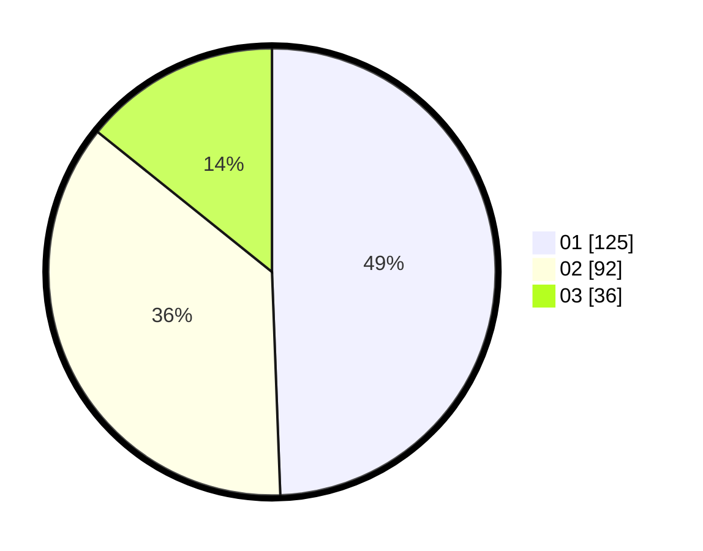

# Hasil

Hasil perolehan suara paslon dapat dilihat pada file paslon-01.txt, paslon-02.txt, dan paslon-03.txt.

Jika tidak ada, artinya data tersebut belum ada pada SIREKAP.

## Perolehan Suara

 * Paslon 01: **125**.
 * Paslon 02: **92**.
 * Paslon 03: **36**.

## Foto C Plano

https://sirekap-obj-formc.kpu.go.id/f585/pemilu/ppwp/31/74/09/10/02/3174091002114-20240214-223329--b91c89ab-feb7-4057-8f46-936cceae72e5.jpg

https://sirekap-obj-formc.kpu.go.id/f585/pemilu/ppwp/31/74/09/10/02/3174091002114-20240214-225047--2ff57eea-8682-4076-8d42-480e9915124e.jpg

https://sirekap-obj-formc.kpu.go.id/f585/pemilu/ppwp/31/74/09/10/02/3174091002114-20240214-193035--c0298660-92a0-4db9-bc33-9dee6ad5cf92.jpg

## DATA PEMILIH TETAP

Jumlah pemilih dalam DPT: **275**.
 * L: **141**.
 * P: **134**.

## DATA PENGGUNA HAK PILIH

Jumlah pengguna hak pilih dalam DPT: **248**.
 * L: **125**.
 * P: **123**.

Jumlah pengguna hak pilih dalam DPTb: **5**.
 * L: **3**.
 * P: **2**.

Jumlah pengguna hak pilih dalam DPK: **4**.
 * L: **1**.
 * P: **3**.

Jumlah pengguna hak pilih: **257**.
 * L: **129**.
 * P: **128**.

## JUMLAH SUARA SAH DAN TIDAK SAH

JUMLAH SELURUH SUARA SAH: **254**.

JUMLAH SUARA TIDAK SAH: **3**.

JUMLAH SELURUH SUARA SAH DAN SUARA TIDAK SAH: **257**.
