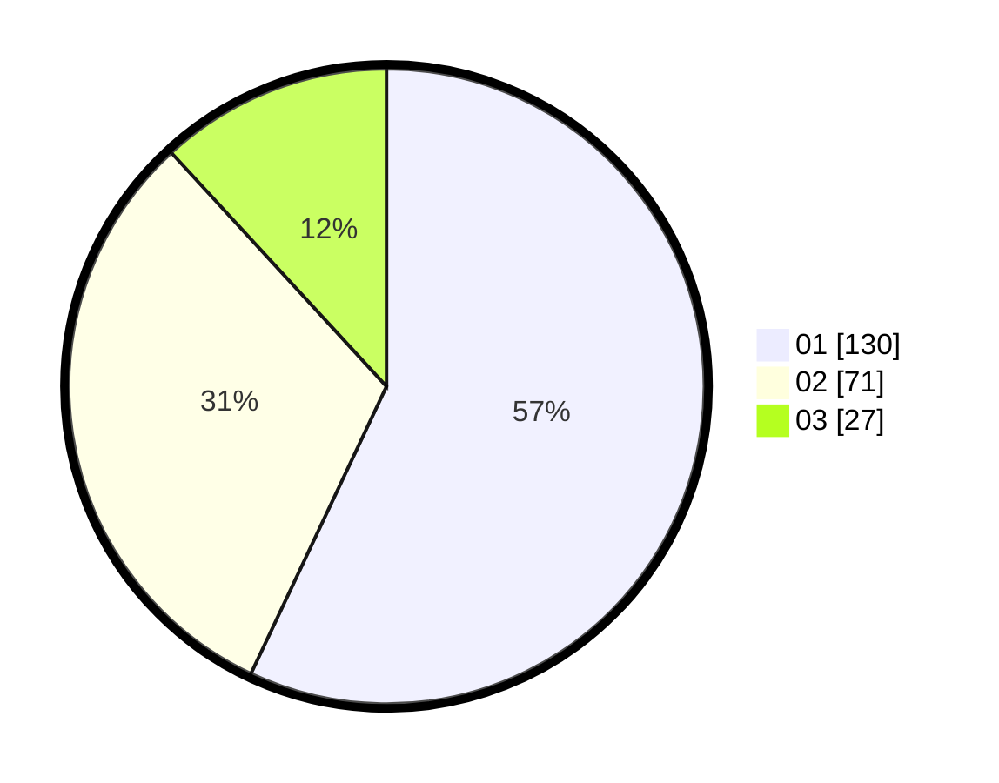

# Hasil

Hasil perolehan suara paslon dapat dilihat pada file paslon-01.txt, paslon-02.txt, dan paslon-03.txt.

Jika tidak ada, artinya data tersebut belum ada pada SIREKAP.

## Perolehan Suara

 * Paslon 01: **130**.
 * Paslon 02: **71**.
 * Paslon 03: **27**.

## Foto C Plano

https://sirekap-obj-formc.kpu.go.id/8fde/pemilu/ppwp/31/74/09/10/02/3174091002117-20240214-184711--b0f4ee4e-fa7c-4e47-826d-4c2caf1245b7.jpg

https://sirekap-obj-formc.kpu.go.id/8fde/pemilu/ppwp/31/74/09/10/02/3174091002117-20240214-230017--ea7eec04-3c06-4f10-84ce-8661ebb8408d.jpg

https://sirekap-obj-formc.kpu.go.id/8fde/pemilu/ppwp/31/74/09/10/02/3174091002117-20240214-230102--6e3e20b6-680d-4897-8718-b6546e614041.jpg
