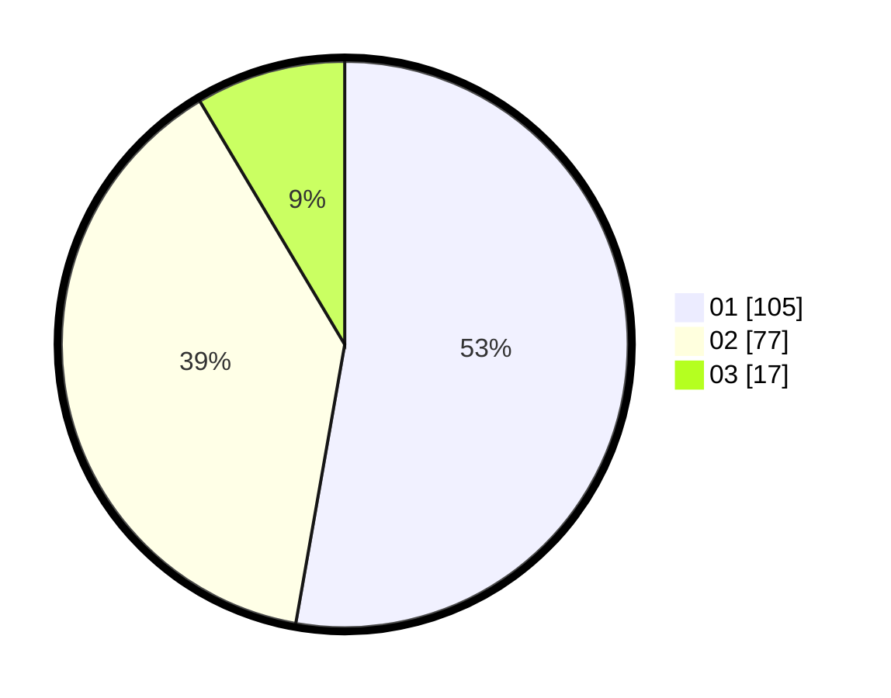

# Hasil

Hasil perolehan suara paslon dapat dilihat pada file paslon-01.txt, paslon-02.txt, dan paslon-03.txt.

Jika tidak ada, artinya data tersebut belum ada pada SIREKAP.

## Perolehan Suara

 * Paslon 01: **105**.
 * Paslon 02: **77**.
 * Paslon 03: **17**.

## Foto C Plano

https://sirekap-obj-formc.kpu.go.id/b00f/pemilu/ppwp/31/74/09/10/02/3174091002119-20240216-134345--9d93cd32-7efe-44e8-bf1f-89c71814b663.jpg

https://sirekap-obj-formc.kpu.go.id/b00f/pemilu/ppwp/31/74/09/10/02/3174091002119-20240216-134346--2f8f6ea3-4e43-4081-b615-42d151ea92f5.jpg

https://sirekap-obj-formc.kpu.go.id/b00f/pemilu/ppwp/31/74/09/10/02/3174091002119-20240216-134345--ce76c855-7dbe-4fd3-b55c-24810c77960d.jpg

## DATA PEMILIH TETAP

Jumlah pemilih dalam DPT: **264**.
 * L: **115**.
 * P: **149**.

## DATA PENGGUNA HAK PILIH

Jumlah pengguna hak pilih dalam DPT: **199**.
 * L: **88**.
 * P: **111**.

Jumlah pengguna hak pilih dalam DPTb: **3**.
 * L: **1**.
 * P: **2**.

Jumlah pengguna hak pilih dalam DPK: **2**.
 * L: **1**.
 * P: **1**.

Jumlah pengguna hak pilih: **204**.
 * L: **90**.
 * P: **114**.

## JUMLAH SUARA SAH DAN TIDAK SAH

JUMLAH SELURUH SUARA SAH: **199**.

JUMLAH SUARA TIDAK SAH: **5**.

JUMLAH SELURUH SUARA SAH DAN SUARA TIDAK SAH: **204**.
