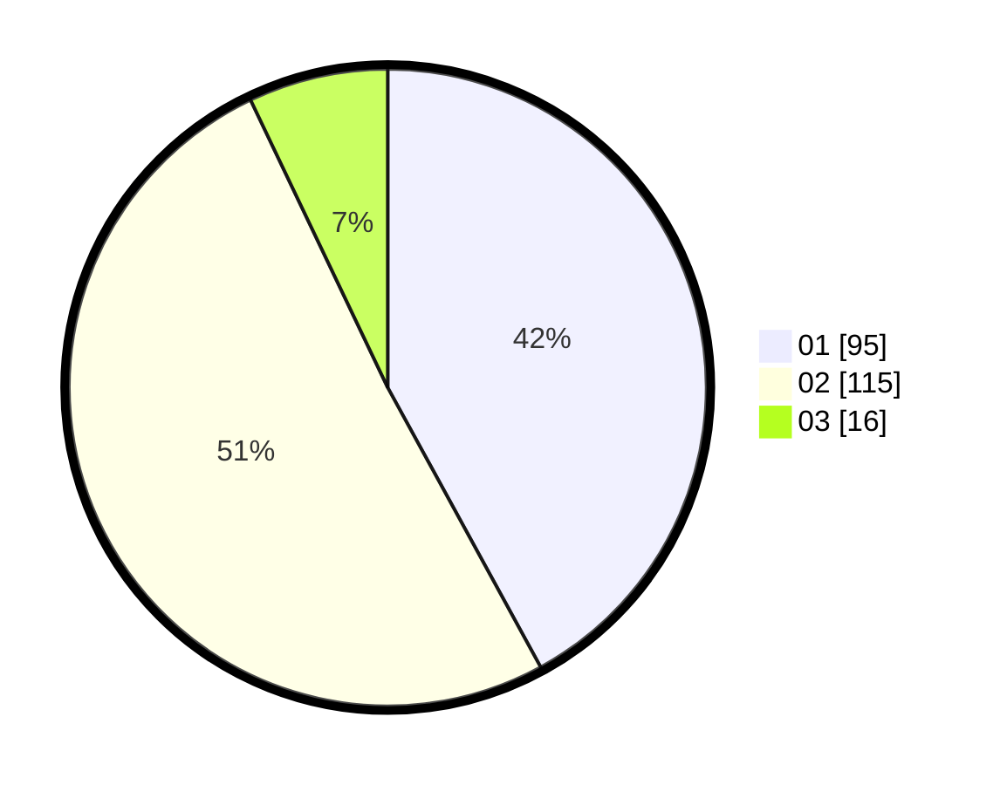

# Hasil

Hasil perolehan suara paslon dapat dilihat pada file paslon-01.txt, paslon-02.txt, dan paslon-03.txt.

Jika tidak ada, artinya data tersebut belum ada pada SIREKAP.

## Perolehan Suara

 * Paslon 01: **95**.
 * Paslon 02: **115**.
 * Paslon 03: **16**.

## Foto C Plano

https://sirekap-obj-formc.kpu.go.id/dd91/pemilu/ppwp/31/74/09/10/02/3174091002128-20240214-155749--15c67ca2-e772-47b6-936c-c903163251ec.jpg

https://sirekap-obj-formc.kpu.go.id/dd91/pemilu/ppwp/31/74/09/10/02/3174091002128-20240214-155911--50913f6e-fb82-4d69-aee0-69361fdcda41.jpg

https://sirekap-obj-formc.kpu.go.id/dd91/pemilu/ppwp/31/74/09/10/02/3174091002128-20240214-160144--edcb7f1d-d064-48e8-bfb0-1f2b5a5e495a.jpg

## DATA PEMILIH TETAP

Jumlah pemilih dalam DPT: **261**.
 * L: **122**.
 * P: **139**.

## DATA PENGGUNA HAK PILIH

Jumlah pengguna hak pilih dalam DPT: **232**.
 * L: **107**.
 * P: **125**.

Jumlah pengguna hak pilih dalam DPTb: **0**.
 * L: **0**.
 * P: **0**.

Jumlah pengguna hak pilih dalam DPK: **0**.
 * L: **0**.
 * P: **0**.

Jumlah pengguna hak pilih: **232**.
 * L: **107**.
 * P: **125**.

## JUMLAH SUARA SAH DAN TIDAK SAH

JUMLAH SELURUH SUARA SAH: **226**.

JUMLAH SUARA TIDAK SAH: **6**.

JUMLAH SELURUH SUARA SAH DAN SUARA TIDAK SAH: **232**.
