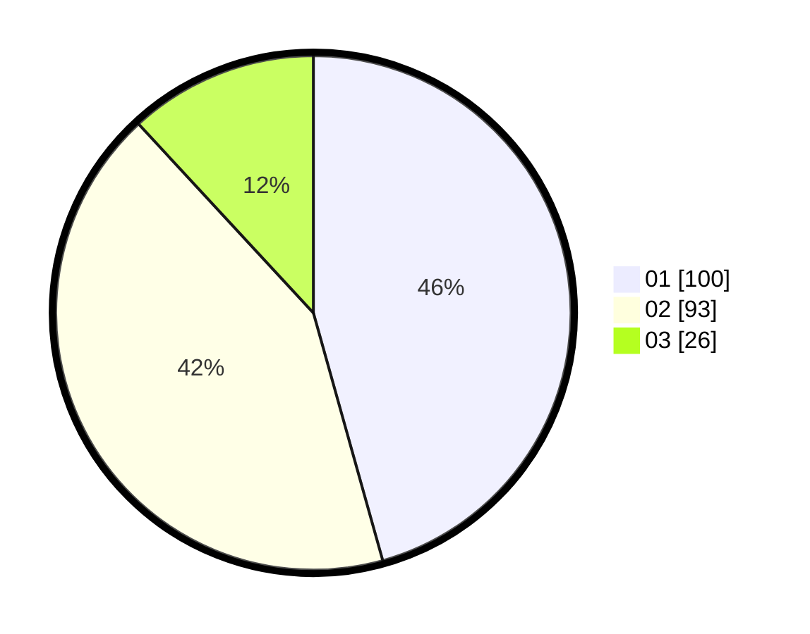

# Hasil

Hasil perolehan suara paslon dapat dilihat pada file paslon-01.txt, paslon-02.txt, dan paslon-03.txt.

Jika tidak ada, artinya data tersebut belum ada pada SIREKAP.

## Perolehan Suara

 * Paslon 01: **100**.
 * Paslon 02: **93**.
 * Paslon 03: **26**.

## Foto C Plano

https://sirekap-obj-formc.kpu.go.id/6a06/pemilu/ppwp/31/74/09/10/02/3174091002131-20240215-020816--76c59755-97a1-45fe-b8b8-215b30334563.jpg

https://sirekap-obj-formc.kpu.go.id/6a06/pemilu/ppwp/31/74/09/10/02/3174091002131-20240215-020826--9a1af7d4-9675-4786-984b-652d74ec8630.jpg

https://sirekap-obj-formc.kpu.go.id/6a06/pemilu/ppwp/31/74/09/10/02/3174091002131-20240215-020832--c60bb866-43b7-45cc-9a12-9275e6877e47.jpg

## DATA PEMILIH TETAP

Jumlah pemilih dalam DPT: **259**.
 * L: **136**.
 * P: **133**.

## DATA PENGGUNA HAK PILIH

Jumlah pengguna hak pilih dalam DPT: **221**.
 * L: **110**.
 * P: **111**.

Jumlah pengguna hak pilih dalam DPTb: **77**.
 * L: **505**.
 * P: **555**.

Jumlah pengguna hak pilih dalam DPK: **0**.
 * L: **0**.
 * P: **0**.

Jumlah pengguna hak pilih: **221**.
 * L: **110**.
 * P: **111**.

## JUMLAH SUARA SAH DAN TIDAK SAH

JUMLAH SELURUH SUARA SAH: **219**.

JUMLAH SUARA TIDAK SAH: **2**.

JUMLAH SELURUH SUARA SAH DAN SUARA TIDAK SAH: **221**.
