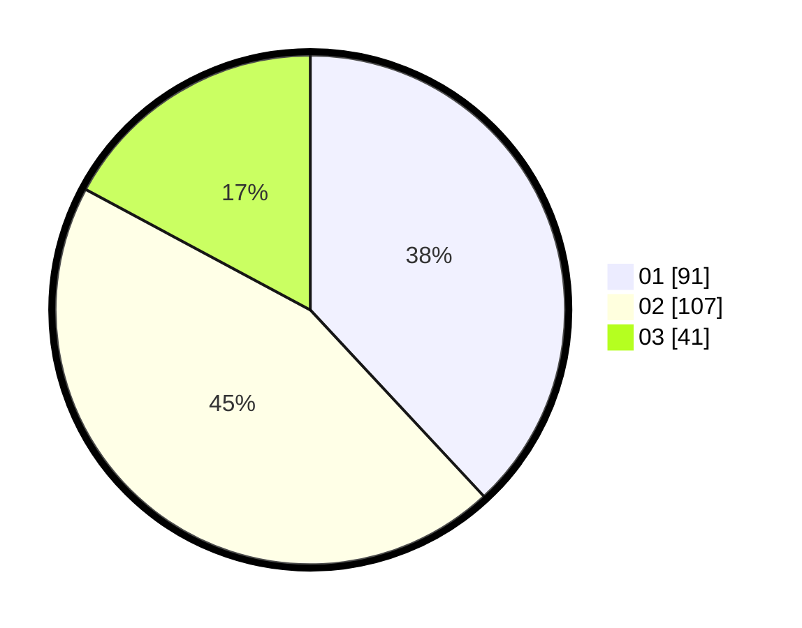

# Hasil

Hasil perolehan suara paslon dapat dilihat pada file paslon-01.txt, paslon-02.txt, dan paslon-03.txt.

Jika tidak ada, artinya data tersebut belum ada pada SIREKAP.

## Perolehan Suara

 * Paslon 01: **91**.
 * Paslon 02: **107**.
 * Paslon 03: **41**.

## Foto C Plano

https://sirekap-obj-formc.kpu.go.id/9f69/pemilu/ppwp/31/74/09/10/02/3174091002133-20240216-031128--769715c4-b549-42c1-a14d-544f6482e34c.jpg

https://sirekap-obj-formc.kpu.go.id/9f69/pemilu/ppwp/31/74/09/10/02/3174091002133-20240216-031135--fc6a9e82-93bd-41d3-a732-68fb80c29b5d.jpg

https://sirekap-obj-formc.kpu.go.id/9f69/pemilu/ppwp/31/74/09/10/02/3174091002133-20240216-031132--ff836d61-80ee-47bc-9291-6b66f67e6845.jpg

## DATA PEMILIH TETAP

Jumlah pemilih dalam DPT: **275**.
 * L: **133**.
 * P: **142**.

## DATA PENGGUNA HAK PILIH

Jumlah pengguna hak pilih dalam DPT: **239**.
 * L: **111**.
 * P: **128**.

Jumlah pengguna hak pilih dalam DPTb: **0**.
 * L: **0**.
 * P: **0**.

Jumlah pengguna hak pilih dalam DPK: **0**.
 * L: **0**.
 * P: **0**.

Jumlah pengguna hak pilih: **239**.
 * L: **111**.
 * P: **128**.

## JUMLAH SUARA SAH DAN TIDAK SAH

JUMLAH SELURUH SUARA SAH: **239**.

JUMLAH SUARA TIDAK SAH: **0**.

JUMLAH SELURUH SUARA SAH DAN SUARA TIDAK SAH: **239**.
