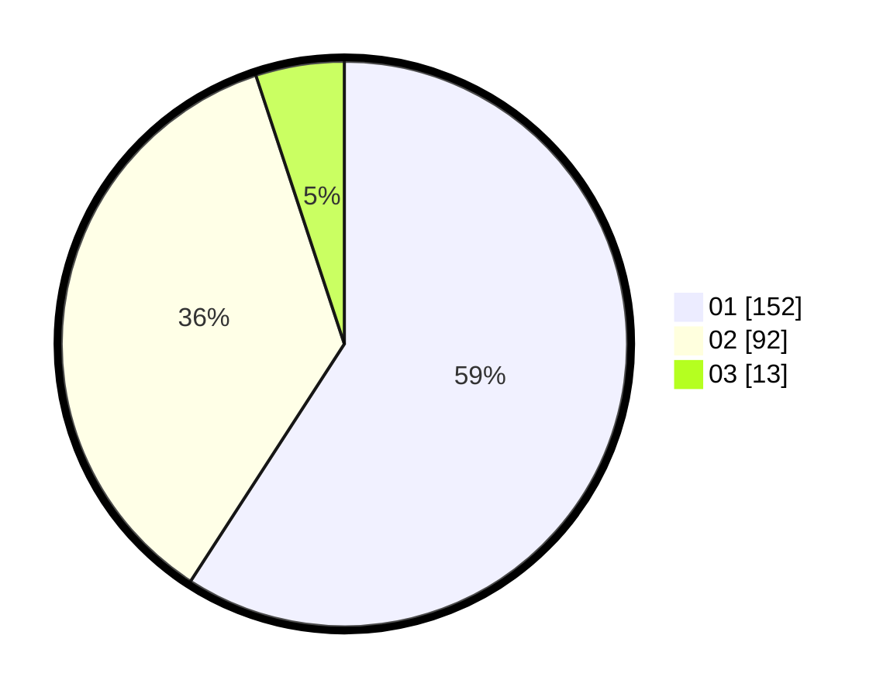

# Hasil

Hasil perolehan suara paslon dapat dilihat pada file paslon-01.txt, paslon-02.txt, dan paslon-03.txt.

Jika tidak ada, artinya data tersebut belum ada pada SIREKAP.

## Perolehan Suara

 * Paslon 01: **152**.
 * Paslon 02: **92**.
 * Paslon 03: **13**.

## Foto C Plano

https://sirekap-obj-formc.kpu.go.id/60e9/pemilu/ppwp/31/74/09/10/02/3174091002139-20240216-145524--41e24779-7f33-4957-a5f6-f95219a3e508.jpg

https://sirekap-obj-formc.kpu.go.id/60e9/pemilu/ppwp/31/74/09/10/02/3174091002139-20240216-145525--952e466c-7885-464d-9e83-8d9401a05ab5.jpg

https://sirekap-obj-formc.kpu.go.id/60e9/pemilu/ppwp/31/74/09/10/02/3174091002139-20240216-145525--a5d3ebb0-3b73-44fa-a2cb-9a7719af2d7f.jpg

## DATA PEMILIH TETAP

Jumlah pemilih dalam DPT: **293**.
 * L: **137**.
 * P: **156**.

## DATA PENGGUNA HAK PILIH

Jumlah pengguna hak pilih dalam DPT: **256**.
 * L: **116**.
 * P: **140**.

Jumlah pengguna hak pilih dalam DPTb: **1**.
 * L: **1**.
 * P: **0**.

Jumlah pengguna hak pilih dalam DPK: **4**.
 * L: **3**.
 * P: **1**.

Jumlah pengguna hak pilih: **261**.
 * L: **120**.
 * P: **141**.

## JUMLAH SUARA SAH DAN TIDAK SAH

JUMLAH SELURUH SUARA SAH: **257**.

JUMLAH SUARA TIDAK SAH: **4**.

JUMLAH SELURUH SUARA SAH DAN SUARA TIDAK SAH: **261**.
