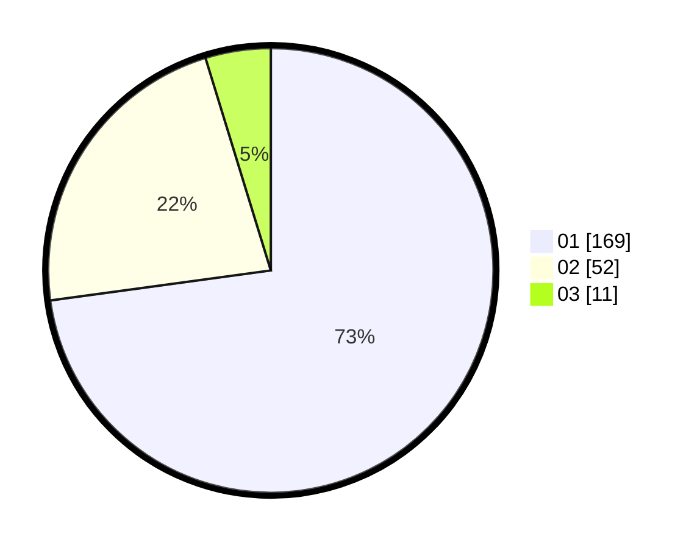

# Hasil

Hasil perolehan suara paslon dapat dilihat pada file paslon-01.txt, paslon-02.txt, dan paslon-03.txt.

Jika tidak ada, artinya data tersebut belum ada pada SIREKAP.

## Perolehan Suara

 * Paslon 01: **169**.
 * Paslon 02: **52**.
 * Paslon 03: **11**.

## Foto C Plano

https://sirekap-obj-formc.kpu.go.id/c9bd/pemilu/ppwp/31/74/09/10/02/3174091002140-20240215-065710--7262f3c3-18c3-4f93-9e96-9fc991b8a658.jpg

https://sirekap-obj-formc.kpu.go.id/c9bd/pemilu/ppwp/31/74/09/10/02/3174091002140-20240216-135505--1d8290ea-d005-4881-9824-fa66df241cc3.jpg

https://sirekap-obj-formc.kpu.go.id/c9bd/pemilu/ppwp/31/74/09/10/02/3174091002140-20240215-065942--ca6ce738-de45-41d0-96d8-b74bf03e499c.jpg

## DATA PEMILIH TETAP

Jumlah pemilih dalam DPT: **274**.
 * L: **127**.
 * P: **147**.

## DATA PENGGUNA HAK PILIH

Jumlah pengguna hak pilih dalam DPT: **232**.
 * L: **106**.
 * P: **126**.

Jumlah pengguna hak pilih dalam DPTb: **0**.
 * L: **0**.
 * P: **0**.

Jumlah pengguna hak pilih dalam DPK: **4**.
 * L: **2**.
 * P: **2**.

Jumlah pengguna hak pilih: **236**.
 * L: **108**.
 * P: **128**.

## JUMLAH SUARA SAH DAN TIDAK SAH

JUMLAH SELURUH SUARA SAH: **232**.

JUMLAH SUARA TIDAK SAH: **4**.

JUMLAH SELURUH SUARA SAH DAN SUARA TIDAK SAH: **236**.
