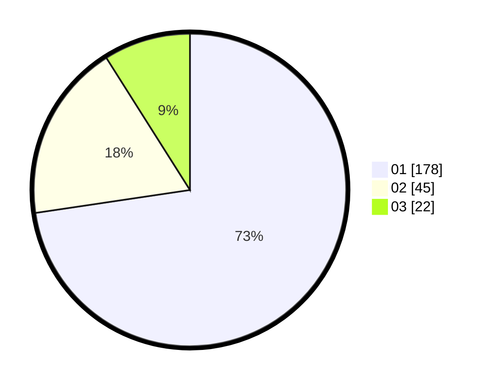

# Hasil

Hasil perolehan suara paslon dapat dilihat pada file paslon-01.txt, paslon-02.txt, dan paslon-03.txt.

Jika tidak ada, artinya data tersebut belum ada pada SIREKAP.

## Perolehan Suara

 * Paslon 01: **178**.
 * Paslon 02: **45**.
 * Paslon 03: **22**.

## Foto C Plano

https://sirekap-obj-formc.kpu.go.id/91d2/pemilu/ppwp/31/74/09/10/02/3174091002142-20240214-191942--c7216fa3-2b39-4700-ad12-659699933efb.jpg

https://sirekap-obj-formc.kpu.go.id/91d2/pemilu/ppwp/31/74/09/10/02/3174091002142-20240214-191950--36a7fba6-dd98-4320-882b-6cff528b1308.jpg

https://sirekap-obj-formc.kpu.go.id/91d2/pemilu/ppwp/31/74/09/10/02/3174091002142-20240214-192001--93fbc6c4-78cc-4b24-8a0e-cb3e86f89f39.jpg

## DATA PEMILIH TETAP

Jumlah pemilih dalam DPT: **288**.
 * L: **135**.
 * P: **153**.

## DATA PENGGUNA HAK PILIH

Jumlah pengguna hak pilih dalam DPT: **288**.
 * L: **135**.
 * P: **153**.

Jumlah pengguna hak pilih dalam DPTb: **2**.
 * L: **1**.
 * P: **1**.

Jumlah pengguna hak pilih dalam DPK: **0**.
 * L: **0**.
 * P: **0**.

Jumlah pengguna hak pilih: **290**.
 * L: **136**.
 * P: **154**.

## JUMLAH SUARA SAH DAN TIDAK SAH

JUMLAH SELURUH SUARA SAH: **245**.

JUMLAH SUARA TIDAK SAH: **5**.

JUMLAH SELURUH SUARA SAH DAN SUARA TIDAK SAH: **250**.
