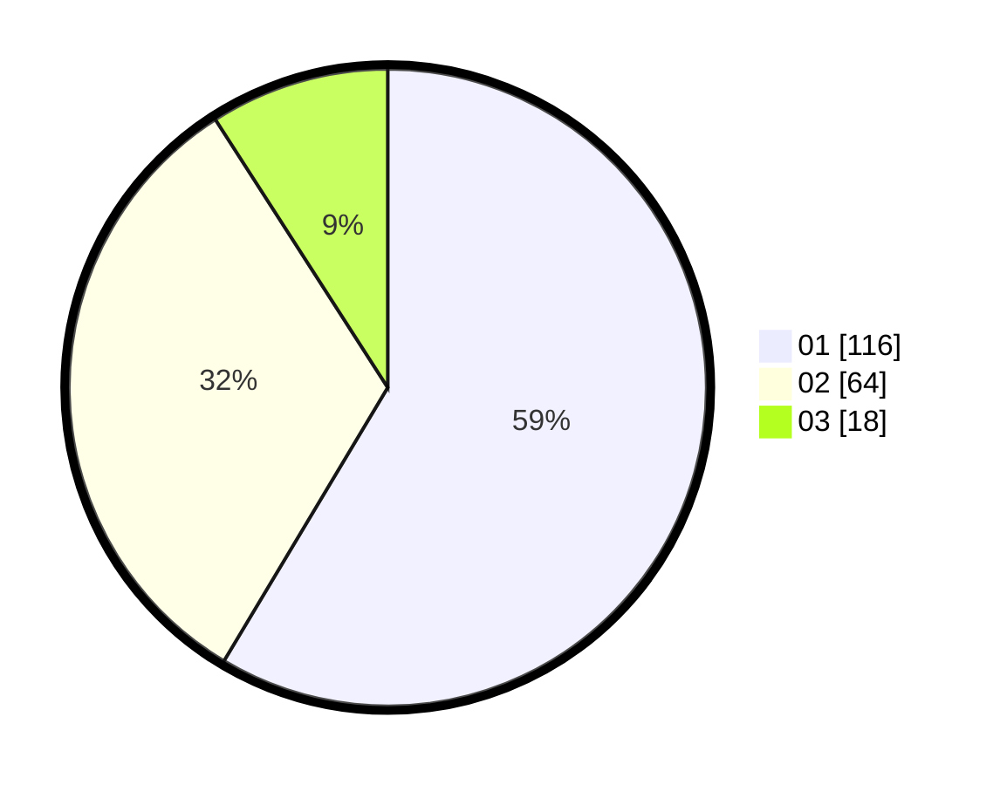

# Hasil

Hasil perolehan suara paslon dapat dilihat pada file paslon-01.txt, paslon-02.txt, dan paslon-03.txt.

Jika tidak ada, artinya data tersebut belum ada pada SIREKAP.

## Perolehan Suara

 * Paslon 01: **116**.
 * Paslon 02: **64**.
 * Paslon 03: **18**.

## Foto C Plano

https://sirekap-obj-formc.kpu.go.id/06ea/pemilu/ppwp/31/74/09/10/02/3174091002143-20240214-225945--2bad5f8d-3d41-4edb-bdfc-06442c2fcc0c.jpg

https://sirekap-obj-formc.kpu.go.id/06ea/pemilu/ppwp/31/74/09/10/02/3174091002143-20240214-230138--19ab4159-3908-44b1-a622-48835adaf7e1.jpg

https://sirekap-obj-formc.kpu.go.id/06ea/pemilu/ppwp/31/74/09/10/02/3174091002143-20240214-230302--cf3d203f-fad6-480f-b466-6cc55d053c24.jpg
