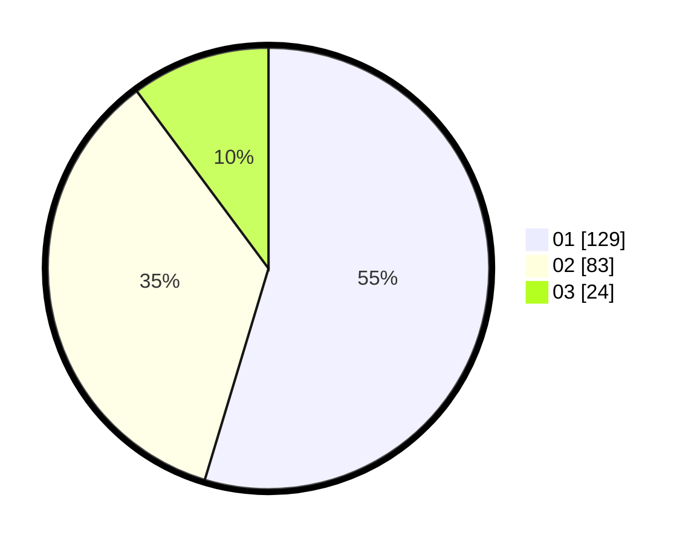

# Hasil

Hasil perolehan suara paslon dapat dilihat pada file paslon-01.txt, paslon-02.txt, dan paslon-03.txt.

Jika tidak ada, artinya data tersebut belum ada pada SIREKAP.

## Perolehan Suara

 * Paslon 01: **129**.
 * Paslon 02: **83**.
 * Paslon 03: **24**.

## Foto C Plano

https://sirekap-obj-formc.kpu.go.id/3c34/pemilu/ppwp/31/74/09/10/02/3174091002148-20240214-194859--af25ac66-4f6e-48f4-95af-f34c9758a3f2.jpg

https://sirekap-obj-formc.kpu.go.id/3c34/pemilu/ppwp/31/74/09/10/02/3174091002148-20240214-214059--7ddad726-8608-4745-af58-4fa069fb3b10.jpg

https://sirekap-obj-formc.kpu.go.id/3c34/pemilu/ppwp/31/74/09/10/02/3174091002148-20240214-194913--c35d004e-0eba-4b59-b7c9-bc014a2a2e7a.jpg

## DATA PEMILIH TETAP

Jumlah pemilih dalam DPT: **265**.
 * L: **120**.
 * P: **145**.

## DATA PENGGUNA HAK PILIH

Jumlah pengguna hak pilih dalam DPT: **234**.
 * L: **104**.
 * P: **130**.

Jumlah pengguna hak pilih dalam DPTb: **0**.
 * L: **0**.
 * P: **0**.

Jumlah pengguna hak pilih dalam DPK: **6**.
 * L: **3**.
 * P: **3**.

Jumlah pengguna hak pilih: **240**.
 * L: **107**.
 * P: **133**.

## JUMLAH SUARA SAH DAN TIDAK SAH

JUMLAH SELURUH SUARA SAH: **236**.

JUMLAH SUARA TIDAK SAH: **4**.

JUMLAH SELURUH SUARA SAH DAN SUARA TIDAK SAH: **240**.
