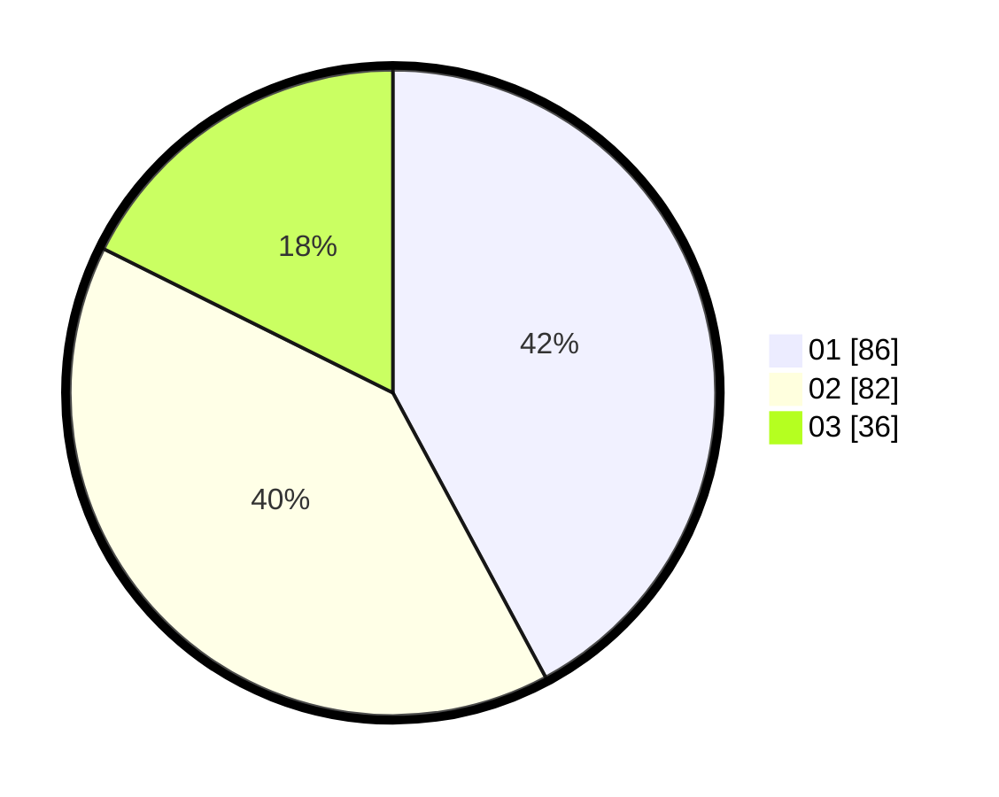

# Hasil

Hasil perolehan suara paslon dapat dilihat pada file paslon-01.txt, paslon-02.txt, dan paslon-03.txt.

Jika tidak ada, artinya data tersebut belum ada pada SIREKAP.

## Perolehan Suara

 * Paslon 01: **86**.
 * Paslon 02: **82**.
 * Paslon 03: **36**.

## Foto C Plano

https://sirekap-obj-formc.kpu.go.id/9537/pemilu/ppwp/31/74/09/10/02/3174091002169-20240214-155109--76206617-053c-4cc5-9e45-922d20ca31c7.jpg

https://sirekap-obj-formc.kpu.go.id/9537/pemilu/ppwp/31/74/09/10/02/3174091002169-20240214-155702--ab9d0744-9cf9-4377-b343-7d714246a6cb.jpg

https://sirekap-obj-formc.kpu.go.id/9537/pemilu/ppwp/31/74/09/10/02/3174091002169-20240214-155316--aa7310d6-1798-4d6d-a171-50eee4c35cce.jpg

## DATA PEMILIH TETAP

Jumlah pemilih dalam DPT: **250**.
 * L: **106**.
 * P: **144**.

## DATA PENGGUNA HAK PILIH

Jumlah pengguna hak pilih dalam DPT: **200**.
 * L: **84**.
 * P: **116**.

Jumlah pengguna hak pilih dalam DPTb: **2**.
 * L: **1**.
 * P: **1**.

Jumlah pengguna hak pilih dalam DPK: **2**.
 * L: **1**.
 * P: **1**.

Jumlah pengguna hak pilih: **204**.
 * L: **86**.
 * P: **118**.

## JUMLAH SUARA SAH DAN TIDAK SAH

JUMLAH SELURUH SUARA SAH: **204**.

JUMLAH SUARA TIDAK SAH: **0**.

JUMLAH SELURUH SUARA SAH DAN SUARA TIDAK SAH: **204**.
