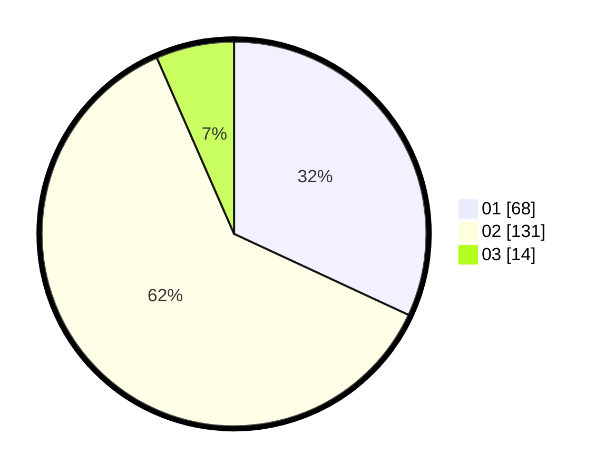

# Hasil

Hasil perolehan suara paslon dapat dilihat pada file paslon-01.txt, paslon-02.txt, dan paslon-03.txt.

Jika tidak ada, artinya data tersebut belum ada pada SIREKAP.

## Perolehan Suara

 * Paslon 01: **68**.
 * Paslon 02: **131**.
 * Paslon 03: **14**.

## Foto C Plano

https://sirekap-obj-formc.kpu.go.id/52e2/pemilu/ppwp/31/74/09/10/02/3174091002172-20240216-134708--b58ebcb2-2d2f-4dd9-8519-afcb52b2f718.jpg

https://sirekap-obj-formc.kpu.go.id/52e2/pemilu/ppwp/31/74/09/10/02/3174091002172-20240216-134709--cce85357-1573-4f99-af88-0c861951c843.jpg

https://sirekap-obj-formc.kpu.go.id/52e2/pemilu/ppwp/31/74/09/10/02/3174091002172-20240216-134709--7b2361ba-0dd0-4baa-ba65-d79ffe47f12d.jpg

## DATA PEMILIH TETAP

Jumlah pemilih dalam DPT: **243**.
 * L: **106**.
 * P: **137**.

## DATA PENGGUNA HAK PILIH

Jumlah pengguna hak pilih dalam DPT: **204**.
 * L: **90**.
 * P: **114**.

Jumlah pengguna hak pilih dalam DPTb: **8**.
 * L: **5**.
 * P: **3**.

Jumlah pengguna hak pilih dalam DPK: **2**.
 * L: **1**.
 * P: **1**.

Jumlah pengguna hak pilih: **214**.
 * L: **96**.
 * P: **118**.

## JUMLAH SUARA SAH DAN TIDAK SAH

JUMLAH SELURUH SUARA SAH: **213**.

JUMLAH SUARA TIDAK SAH: **1**.

JUMLAH SELURUH SUARA SAH DAN SUARA TIDAK SAH: **214**.
