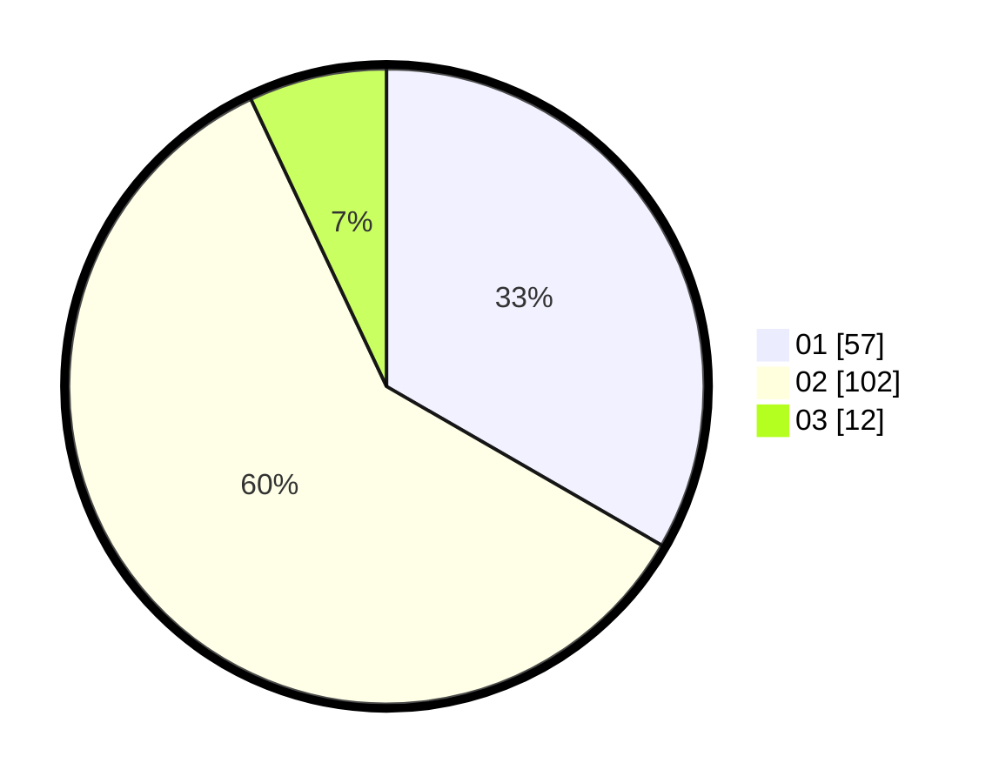

# Hasil

Hasil perolehan suara paslon dapat dilihat pada file paslon-01.txt, paslon-02.txt, dan paslon-03.txt.

Jika tidak ada, artinya data tersebut belum ada pada SIREKAP.

## Perolehan Suara

 * Paslon 01: **57**.
 * Paslon 02: **102**.
 * Paslon 03: **12**.

## Foto C Plano

https://sirekap-obj-formc.kpu.go.id/ad66/pemilu/ppwp/31/74/09/10/02/3174091002173-20240215-122015--3656b2dc-960f-4ea9-b17a-1e1170913e4c.jpg

https://sirekap-obj-formc.kpu.go.id/ad66/pemilu/ppwp/31/74/09/10/02/3174091002173-20240215-122037--72e8a421-b0ec-41d3-8ec4-c74a14246c41.jpg

https://sirekap-obj-formc.kpu.go.id/ad66/pemilu/ppwp/31/74/09/10/02/3174091002173-20240215-122026--5bd4281c-abee-45bd-aeec-e6de623f8637.jpg

## DATA PEMILIH TETAP

Jumlah pemilih dalam DPT: **172**.
 * L: **79**.
 * P: **93**.

## DATA PENGGUNA HAK PILIH

Jumlah pengguna hak pilih dalam DPT: **172**.
 * L: **79**.
 * P: **93**.

Jumlah pengguna hak pilih dalam DPTb: **0**.
 * L: **0**.
 * P: **0**.

Jumlah pengguna hak pilih dalam DPK: **0**.
 * L: **0**.
 * P: **0**.

Jumlah pengguna hak pilih: **172**.
 * L: **79**.
 * P: **93**.

## JUMLAH SUARA SAH DAN TIDAK SAH

JUMLAH SELURUH SUARA SAH: **171**.

JUMLAH SUARA TIDAK SAH: **1**.

JUMLAH SELURUH SUARA SAH DAN SUARA TIDAK SAH: **172**.
