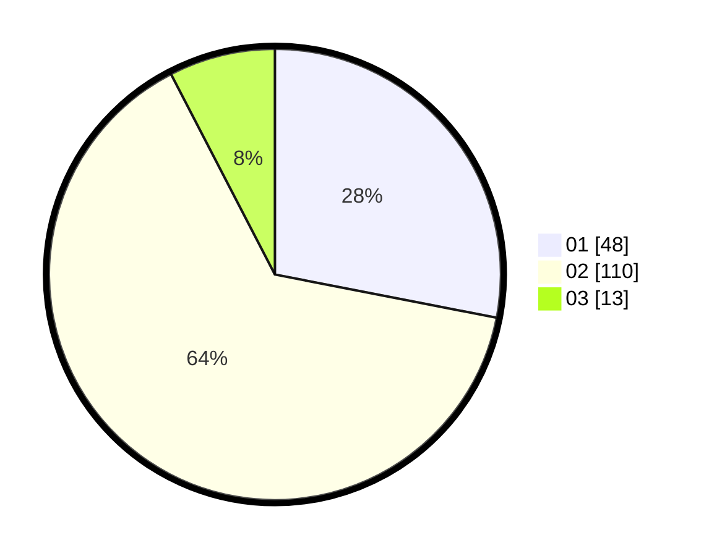

# Hasil

Hasil perolehan suara paslon dapat dilihat pada file paslon-01.txt, paslon-02.txt, dan paslon-03.txt.

Jika tidak ada, artinya data tersebut belum ada pada SIREKAP.

## Perolehan Suara

 * Paslon 01: **48**.
 * Paslon 02: **110**.
 * Paslon 03: **13**.

## Foto C Plano

https://sirekap-obj-formc.kpu.go.id/03e5/pemilu/ppwp/31/74/09/10/02/3174091002174-20240216-031500--6b3e772c-21cd-4cf9-9304-37af0fa7fe97.jpg

https://sirekap-obj-formc.kpu.go.id/03e5/pemilu/ppwp/31/74/09/10/02/3174091002174-20240216-031502--220cb242-44a9-4aed-ac83-8ab7bf6515ce.jpg

https://sirekap-obj-formc.kpu.go.id/03e5/pemilu/ppwp/31/74/09/10/02/3174091002174-20240216-031501--dc82d874-b5c4-4d0c-8670-4f337318b93c.jpg

## DATA PEMILIH TETAP

Jumlah pemilih dalam DPT: **214**.
 * L: **90**.
 * P: **124**.

## DATA PENGGUNA HAK PILIH

Jumlah pengguna hak pilih dalam DPT: **172**.
 * L: **69**.
 * P: **103**.

Jumlah pengguna hak pilih dalam DPTb: **0**.
 * L: **0**.
 * P: **0**.

Jumlah pengguna hak pilih dalam DPK: **2**.
 * L: **0**.
 * P: **2**.

Jumlah pengguna hak pilih: **174**.
 * L: **69**.
 * P: **105**.

## JUMLAH SUARA SAH DAN TIDAK SAH

JUMLAH SELURUH SUARA SAH: **171**.

JUMLAH SUARA TIDAK SAH: **3**.

JUMLAH SELURUH SUARA SAH DAN SUARA TIDAK SAH: **174**.
