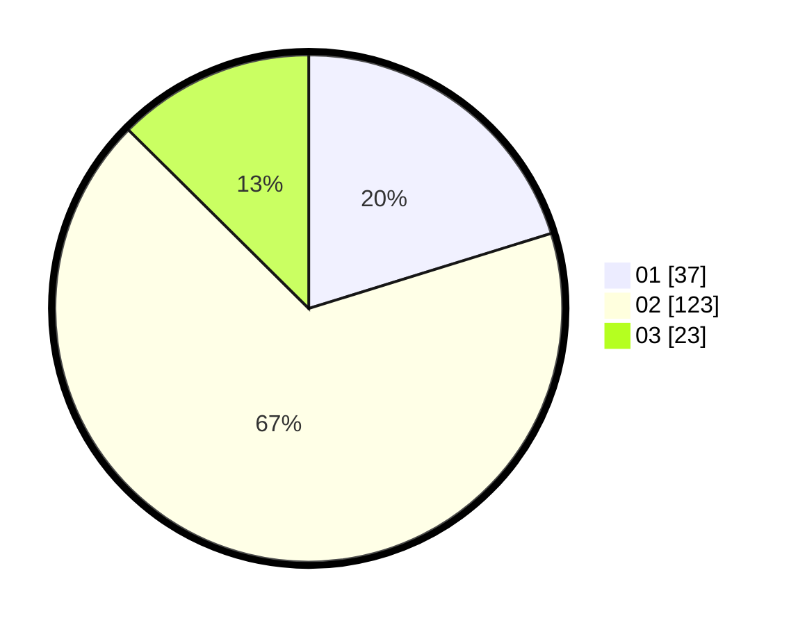

# Hasil

Hasil perolehan suara paslon dapat dilihat pada file paslon-01.txt, paslon-02.txt, dan paslon-03.txt.

Jika tidak ada, artinya data tersebut belum ada pada SIREKAP.

## Perolehan Suara

 * Paslon 01: **37**.
 * Paslon 02: **123**.
 * Paslon 03: **23**.

## Foto C Plano

https://sirekap-obj-formc.kpu.go.id/88fc/pemilu/ppwp/31/74/09/10/02/3174091002196-20240215-225533--5092efd3-8148-4695-afc3-33109e6892e8.jpg

https://sirekap-obj-formc.kpu.go.id/88fc/pemilu/ppwp/31/74/09/10/02/3174091002196-20240215-225537--040daec0-0943-48dd-87bf-bcd14d1b079f.jpg

https://sirekap-obj-formc.kpu.go.id/88fc/pemilu/ppwp/31/74/09/10/02/3174091002196-20240215-225535--cab222e4-d2f0-46c4-88c9-cd9d28904a35.jpg

## DATA PEMILIH TETAP

Jumlah pemilih dalam DPT: **246**.
 * L: **117**.
 * P: **129**.

## DATA PENGGUNA HAK PILIH

Jumlah pengguna hak pilih dalam DPT: **183**.
 * L: **80**.
 * P: **103**.

Jumlah pengguna hak pilih dalam DPTb: **0**.
 * L: **0**.
 * P: **0**.

Jumlah pengguna hak pilih dalam DPK: **2**.
 * L: **1**.
 * P: **1**.

Jumlah pengguna hak pilih: **185**.
 * L: **81**.
 * P: **104**.

## JUMLAH SUARA SAH DAN TIDAK SAH

JUMLAH SELURUH SUARA SAH: **183**.

JUMLAH SUARA TIDAK SAH: **2**.

JUMLAH SELURUH SUARA SAH DAN SUARA TIDAK SAH: **185**.
