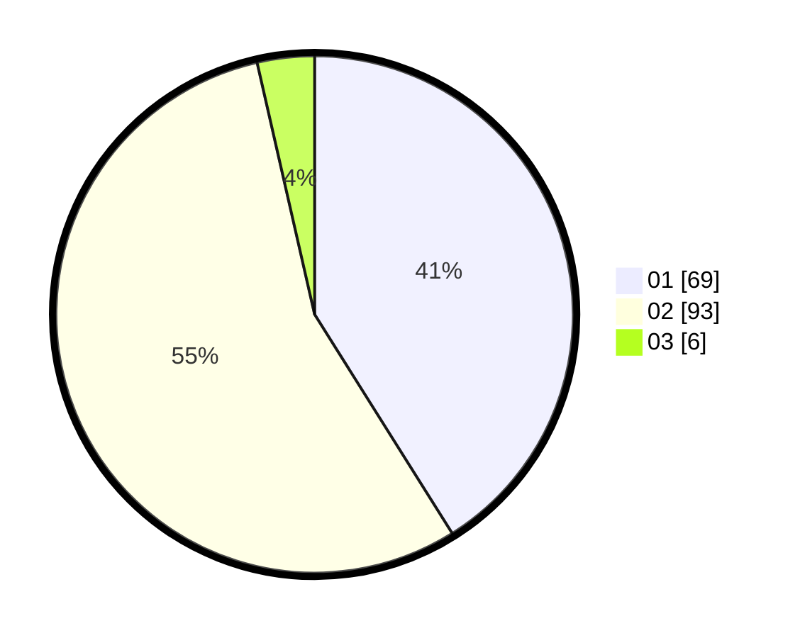

# Hasil

Hasil perolehan suara paslon dapat dilihat pada file paslon-01.txt, paslon-02.txt, dan paslon-03.txt.

Jika tidak ada, artinya data tersebut belum ada pada SIREKAP.

## Perolehan Suara

 * Paslon 01: **69**.
 * Paslon 02: **93**.
 * Paslon 03: **6**.

## Foto C Plano

https://sirekap-obj-formc.kpu.go.id/e070/pemilu/ppwp/31/74/09/10/02/3174091002198-20240214-233545--f9c9fbb3-d291-42e0-83be-2b09f868a84c.jpg

https://sirekap-obj-formc.kpu.go.id/e070/pemilu/ppwp/31/74/09/10/02/3174091002198-20240214-233608--33096c21-f03e-45f7-9a34-7ac0d162c311.jpg

https://sirekap-obj-formc.kpu.go.id/e070/pemilu/ppwp/31/74/09/10/02/3174091002198-20240214-233627--fd0fca5a-6b38-4580-8e39-9ea971d62109.jpg

## DATA PEMILIH TETAP

Jumlah pemilih dalam DPT: **208**.
 * L: **99**.
 * P: **109**.

## DATA PENGGUNA HAK PILIH

Jumlah pengguna hak pilih dalam DPT: **167**.
 * L: **73**.
 * P: **94**.

Jumlah pengguna hak pilih dalam DPTb: **0**.
 * L: **0**.
 * P: **0**.

Jumlah pengguna hak pilih dalam DPK: **3**.
 * L: **2**.
 * P: **1**.

Jumlah pengguna hak pilih: **170**.
 * L: **75**.
 * P: **95**.

## JUMLAH SUARA SAH DAN TIDAK SAH

JUMLAH SELURUH SUARA SAH: **168**.

JUMLAH SUARA TIDAK SAH: **2**.

JUMLAH SELURUH SUARA SAH DAN SUARA TIDAK SAH: **170**.
