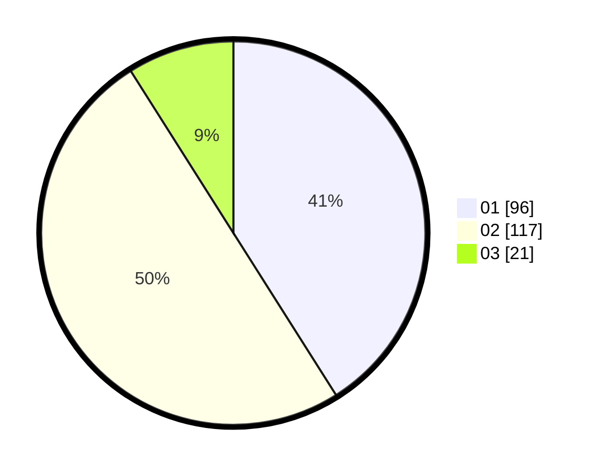

# Hasil

Hasil perolehan suara paslon dapat dilihat pada file paslon-01.txt, paslon-02.txt, dan paslon-03.txt.

Jika tidak ada, artinya data tersebut belum ada pada SIREKAP.

## Perolehan Suara

 * Paslon 01: **96**.
 * Paslon 02: **117**.
 * Paslon 03: **21**.

## Foto C Plano

https://sirekap-obj-formc.kpu.go.id/64a9/pemilu/ppwp/31/74/09/10/03/3174091003001-20240214-194151--68dbd54f-202f-412b-87fc-b16397b9207f.jpg

https://sirekap-obj-formc.kpu.go.id/64a9/pemilu/ppwp/31/74/09/10/03/3174091003001-20240214-194742--1396c9bc-4923-48a3-9d48-49ca33bf88fc.jpg

https://sirekap-obj-formc.kpu.go.id/64a9/pemilu/ppwp/31/74/09/10/03/3174091003001-20240214-195206--8be491ad-73eb-410e-9df4-1d1b1c1526af.jpg

## DATA PEMILIH TETAP

Jumlah pemilih dalam DPT: **297**.
 * L: **148**.
 * P: **149**.

## DATA PENGGUNA HAK PILIH

Jumlah pengguna hak pilih dalam DPT: **218**.
 * L: **109**.
 * P: **109**.

Jumlah pengguna hak pilih dalam DPTb: **16**.
 * L: **7**.
 * P: **9**.

Jumlah pengguna hak pilih dalam DPK: **2**.
 * L: **2**.
 * P: **0**.

Jumlah pengguna hak pilih: **236**.
 * L: **118**.
 * P: **118**.

## JUMLAH SUARA SAH DAN TIDAK SAH

JUMLAH SELURUH SUARA SAH: **234**.

JUMLAH SUARA TIDAK SAH: **2**.

JUMLAH SELURUH SUARA SAH DAN SUARA TIDAK SAH: **236**.
