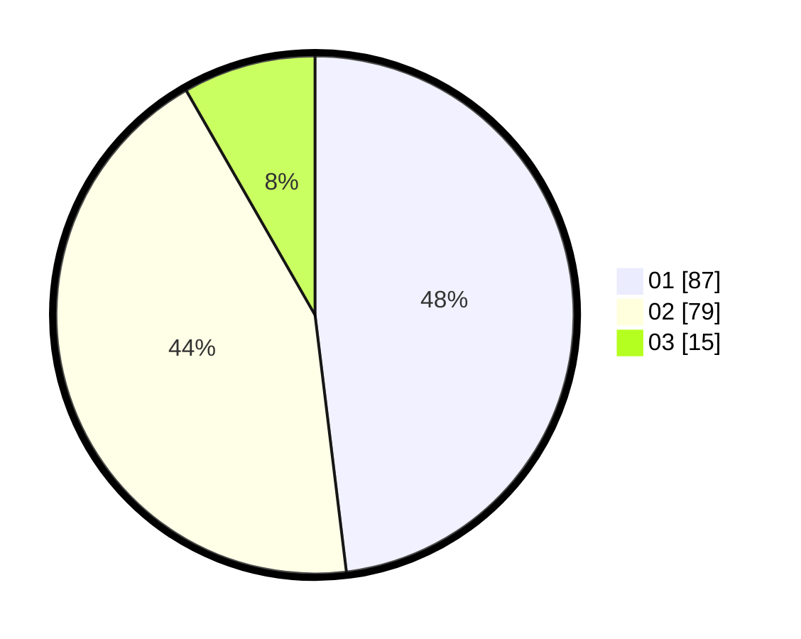

# Hasil

Hasil perolehan suara paslon dapat dilihat pada file paslon-01.txt, paslon-02.txt, dan paslon-03.txt.

Jika tidak ada, artinya data tersebut belum ada pada SIREKAP.

## Perolehan Suara

 * Paslon 01: **87**.
 * Paslon 02: **79**.
 * Paslon 03: **15**.

## Foto C Plano

https://sirekap-obj-formc.kpu.go.id/56d0/pemilu/ppwp/31/74/09/10/03/3174091003008-20240214-155528--7451af54-13d3-406a-a7d1-89e6f2463586.jpg

https://sirekap-obj-formc.kpu.go.id/56d0/pemilu/ppwp/31/74/09/10/03/3174091003008-20240214-155633--81811d77-a0f8-42f0-92ab-80e502ebba7f.jpg

https://sirekap-obj-formc.kpu.go.id/56d0/pemilu/ppwp/31/74/09/10/03/3174091003008-20240214-184950--c79eca58-8f14-45b6-9a43-e59e4f57aaaa.jpg

## DATA PEMILIH TETAP

Jumlah pemilih dalam DPT: **243**.
 * L: **111**.
 * P: **132**.

## DATA PENGGUNA HAK PILIH

Jumlah pengguna hak pilih dalam DPT: **181**.
 * L: **80**.
 * P: **101**.

Jumlah pengguna hak pilih dalam DPTb: **0**.
 * L: **0**.
 * P: **0**.

Jumlah pengguna hak pilih dalam DPK: **1**.
 * L: **0**.
 * P: **1**.

Jumlah pengguna hak pilih: **182**.
 * L: **80**.
 * P: **102**.

## JUMLAH SUARA SAH DAN TIDAK SAH

JUMLAH SELURUH SUARA SAH: **181**.

JUMLAH SUARA TIDAK SAH: **1**.

JUMLAH SELURUH SUARA SAH DAN SUARA TIDAK SAH: **182**.
