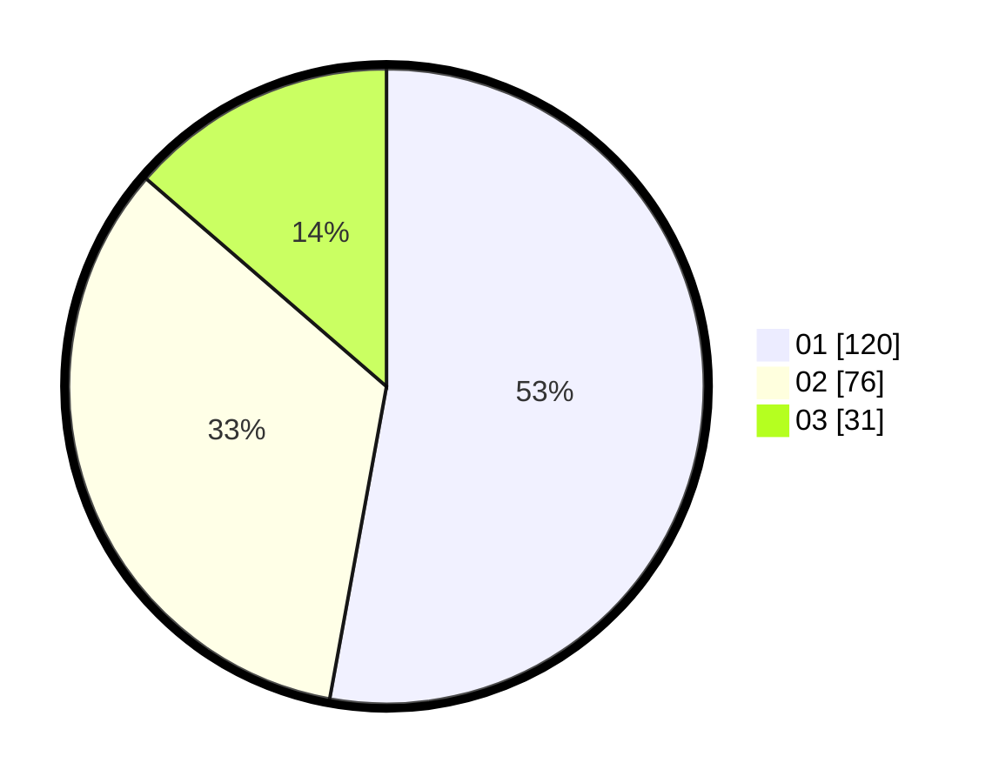

# Hasil

Hasil perolehan suara paslon dapat dilihat pada file paslon-01.txt, paslon-02.txt, dan paslon-03.txt.

Jika tidak ada, artinya data tersebut belum ada pada SIREKAP.

## Perolehan Suara

 * Paslon 01: **120**.
 * Paslon 02: **76**.
 * Paslon 03: **31**.

## Foto C Plano

https://sirekap-obj-formc.kpu.go.id/023e/pemilu/ppwp/31/74/09/10/03/3174091003014-20240216-135336--04716e30-a7cf-4f70-85e3-c8dca02ccdc0.jpg

https://sirekap-obj-formc.kpu.go.id/023e/pemilu/ppwp/31/74/09/10/03/3174091003014-20240216-135338--b8c5ac5d-583d-432e-a7de-2061f630fc95.jpg

https://sirekap-obj-formc.kpu.go.id/023e/pemilu/ppwp/31/74/09/10/03/3174091003014-20240216-135337--5f69e813-5b01-47b7-b3cf-ff11a7ffd7ac.jpg

## DATA PEMILIH TETAP

Jumlah pemilih dalam DPT: **268**.
 * L: **135**.
 * P: **133**.

## DATA PENGGUNA HAK PILIH

Jumlah pengguna hak pilih dalam DPT: **224**.
 * L: **105**.
 * P: **119**.

Jumlah pengguna hak pilih dalam DPTb: **0**.
 * L: **0**.
 * P: **0**.

Jumlah pengguna hak pilih dalam DPK: **4**.
 * L: **3**.
 * P: **1**.

Jumlah pengguna hak pilih: **228**.
 * L: **108**.
 * P: **120**.

## JUMLAH SUARA SAH DAN TIDAK SAH

JUMLAH SELURUH SUARA SAH: **227**.

JUMLAH SUARA TIDAK SAH: **1**.

JUMLAH SELURUH SUARA SAH DAN SUARA TIDAK SAH: **228**.
