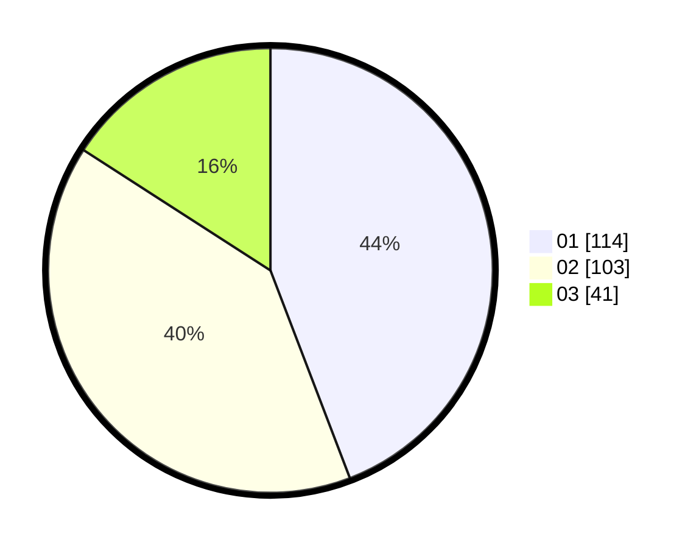

# Hasil

Hasil perolehan suara paslon dapat dilihat pada file paslon-01.txt, paslon-02.txt, dan paslon-03.txt.

Jika tidak ada, artinya data tersebut belum ada pada SIREKAP.

## Perolehan Suara

 * Paslon 01: **114**.
 * Paslon 02: **103**.
 * Paslon 03: **41**.

## Foto C Plano

https://sirekap-obj-formc.kpu.go.id/37d5/pemilu/ppwp/31/74/09/10/03/3174091003021-20240214-201556--035a04ba-aa30-4ad7-8230-90d5b45f6205.jpg

https://sirekap-obj-formc.kpu.go.id/37d5/pemilu/ppwp/31/74/09/10/03/3174091003021-20240214-201423--878a9c37-5603-470f-ac5e-a4e23dfc2f0e.jpg

https://sirekap-obj-formc.kpu.go.id/37d5/pemilu/ppwp/31/74/09/10/03/3174091003021-20240214-201520--fa34157a-269c-4c51-ad50-0de811e9eb62.jpg

## DATA PEMILIH TETAP

Jumlah pemilih dalam DPT: **300**.
 * L: **146**.
 * P: **154**.

## DATA PENGGUNA HAK PILIH

Jumlah pengguna hak pilih dalam DPT: **248**.
 * L: **115**.
 * P: **133**.

Jumlah pengguna hak pilih dalam DPTb: **13**.
 * L: **6**.
 * P: **7**.

Jumlah pengguna hak pilih dalam DPK: **1**.
 * L: **0**.
 * P: **1**.

Jumlah pengguna hak pilih: **262**.
 * L: **121**.
 * P: **141**.

## JUMLAH SUARA SAH DAN TIDAK SAH

JUMLAH SELURUH SUARA SAH: **258**.

JUMLAH SUARA TIDAK SAH: **4**.

JUMLAH SELURUH SUARA SAH DAN SUARA TIDAK SAH: **262**.
