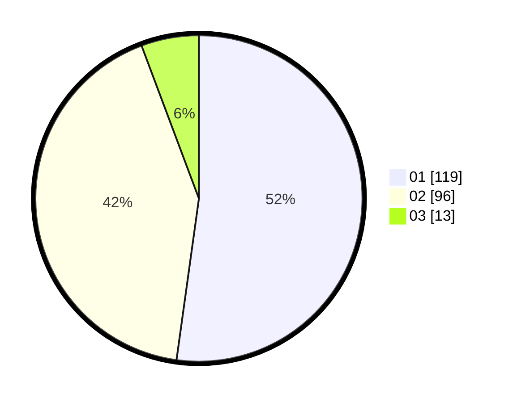

# Hasil

Hasil perolehan suara paslon dapat dilihat pada file paslon-01.txt, paslon-02.txt, dan paslon-03.txt.

Jika tidak ada, artinya data tersebut belum ada pada SIREKAP.

## Perolehan Suara

 * Paslon 01: **119**.
 * Paslon 02: **96**.
 * Paslon 03: **13**.

## Foto C Plano

https://sirekap-obj-formc.kpu.go.id/a877/pemilu/ppwp/31/74/09/10/03/3174091003034-20240215-221120--da071dbf-2d33-4318-bf54-6bcbe7e81e9f.jpg

https://sirekap-obj-formc.kpu.go.id/a877/pemilu/ppwp/31/74/09/10/03/3174091003034-20240215-221122--4cbd5a44-f851-4186-aced-93ffc589441a.jpg

https://sirekap-obj-formc.kpu.go.id/a877/pemilu/ppwp/31/74/09/10/03/3174091003034-20240215-221121--147ebc21-eeef-4dcb-bb2a-0f5d7a6f74ea.jpg

## DATA PEMILIH TETAP

Jumlah pemilih dalam DPT: **264**.
 * L: **129**.
 * P: **135**.

## DATA PENGGUNA HAK PILIH

Jumlah pengguna hak pilih dalam DPT: **228**.
 * L: **109**.
 * P: **119**.

Jumlah pengguna hak pilih dalam DPTb: **0**.
 * L: **0**.
 * P: **0**.

Jumlah pengguna hak pilih dalam DPK: **3**.
 * L: **2**.
 * P: **1**.

Jumlah pengguna hak pilih: **231**.
 * L: **111**.
 * P: **120**.

## JUMLAH SUARA SAH DAN TIDAK SAH

JUMLAH SELURUH SUARA SAH: **228**.

JUMLAH SUARA TIDAK SAH: **3**.

JUMLAH SELURUH SUARA SAH DAN SUARA TIDAK SAH: **231**.
