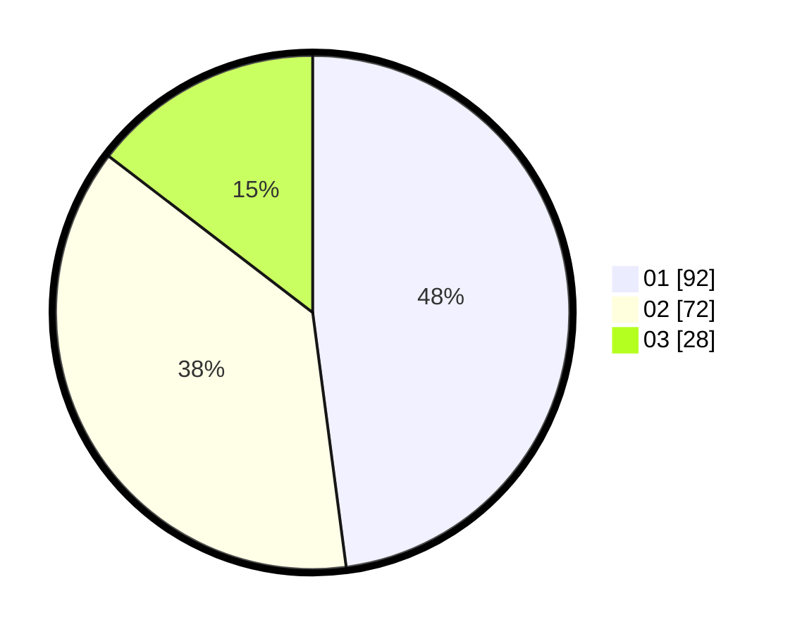

# Hasil

Hasil perolehan suara paslon dapat dilihat pada file paslon-01.txt, paslon-02.txt, dan paslon-03.txt.

Jika tidak ada, artinya data tersebut belum ada pada SIREKAP.

## Perolehan Suara

 * Paslon 01: **92**.
 * Paslon 02: **72**.
 * Paslon 03: **28**.

## Foto C Plano

https://sirekap-obj-formc.kpu.go.id/2d1a/pemilu/ppwp/31/74/09/10/03/3174091003042-20240216-134847--afc01795-6543-4b60-8e18-cedfea145d66.jpg

https://sirekap-obj-formc.kpu.go.id/2d1a/pemilu/ppwp/31/74/09/10/03/3174091003042-20240216-134849--a175b83c-978f-4333-a549-fbf3a3072e1c.jpg

https://sirekap-obj-formc.kpu.go.id/2d1a/pemilu/ppwp/31/74/09/10/03/3174091003042-20240216-134848--5ed16893-a852-4dcf-a001-6cff931d9356.jpg

## DATA PEMILIH TETAP

Jumlah pemilih dalam DPT: **248**.
 * L: **120**.
 * P: **128**.

## DATA PENGGUNA HAK PILIH

Jumlah pengguna hak pilih dalam DPT: **193**.
 * L: **91**.
 * P: **102**.

Jumlah pengguna hak pilih dalam DPTb: **0**.
 * L: **0**.
 * P: **0**.

Jumlah pengguna hak pilih dalam DPK: **5**.
 * L: **4**.
 * P: **1**.

Jumlah pengguna hak pilih: **198**.
 * L: **95**.
 * P: **103**.

## JUMLAH SUARA SAH DAN TIDAK SAH

JUMLAH SELURUH SUARA SAH: **192**.

JUMLAH SUARA TIDAK SAH: **6**.

JUMLAH SELURUH SUARA SAH DAN SUARA TIDAK SAH: **198**.
