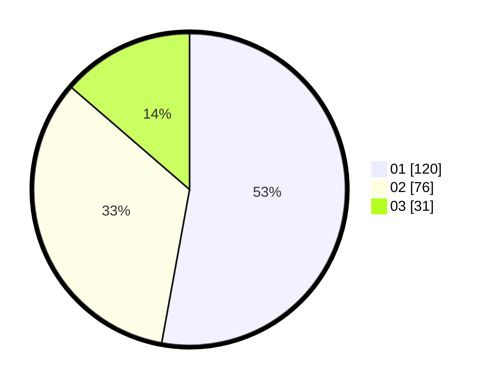

# Hasil

Hasil perolehan suara paslon dapat dilihat pada file paslon-01.txt, paslon-02.txt, dan paslon-03.txt.

Jika tidak ada, artinya data tersebut belum ada pada SIREKAP.

## Perolehan Suara

 * Paslon 01: **120**.
 * Paslon 02: **76**.
 * Paslon 03: **31**.

## Foto C Plano

https://sirekap-obj-formc.kpu.go.id/2ac8/pemilu/ppwp/31/74/09/10/03/3174091003056-20240214-220516--dac621aa-c564-4438-bd64-67bcf318f678.jpg

https://sirekap-obj-formc.kpu.go.id/2ac8/pemilu/ppwp/31/74/09/10/03/3174091003056-20240214-220743--fbdb6d0c-38b9-4ab4-8fa4-95ad19a2458f.jpg

https://sirekap-obj-formc.kpu.go.id/2ac8/pemilu/ppwp/31/74/09/10/03/3174091003056-20240214-220911--76cf9f84-83b6-4eaa-8186-fcafa9041892.jpg
