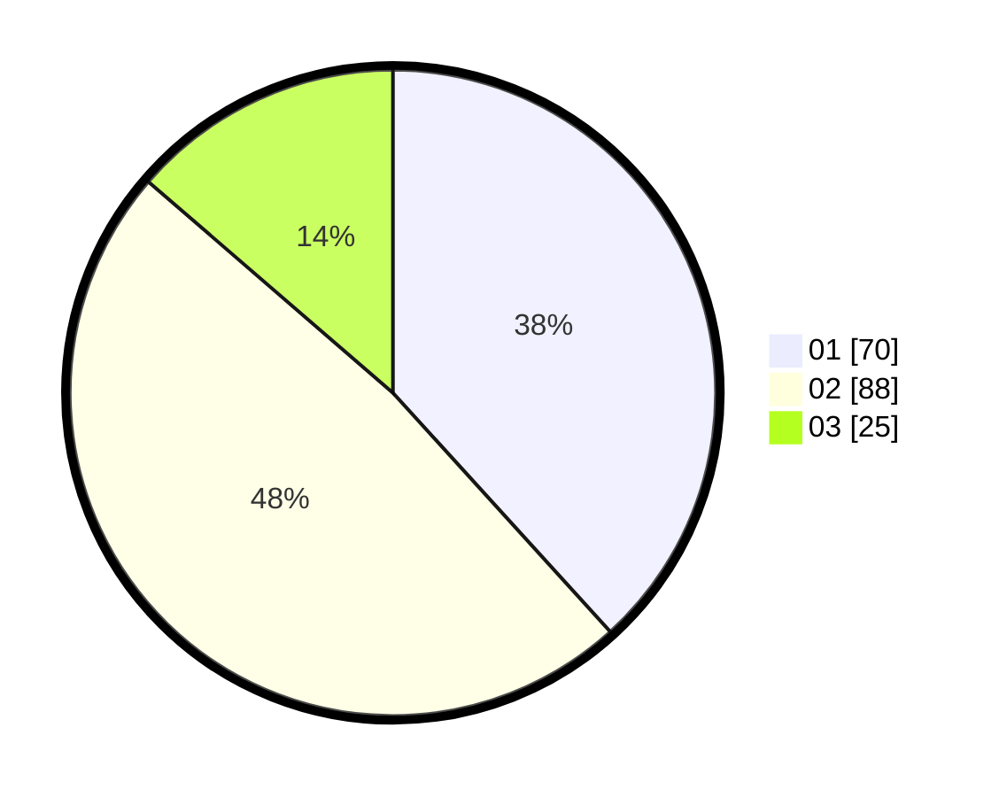

# Hasil

Hasil perolehan suara paslon dapat dilihat pada file paslon-01.txt, paslon-02.txt, dan paslon-03.txt.

Jika tidak ada, artinya data tersebut belum ada pada SIREKAP.

## Perolehan Suara

 * Paslon 01: **70**.
 * Paslon 02: **88**.
 * Paslon 03: **25**.

## Foto C Plano

https://sirekap-obj-formc.kpu.go.id/0798/pemilu/ppwp/31/74/09/10/03/3174091003058-20240216-140935--02793517-cb1c-4799-abc4-aa28d5a59c04.jpg

https://sirekap-obj-formc.kpu.go.id/0798/pemilu/ppwp/31/74/09/10/03/3174091003058-20240216-140937--cee7f194-6370-4799-a2b9-a5aa709ec423.jpg

https://sirekap-obj-formc.kpu.go.id/0798/pemilu/ppwp/31/74/09/10/03/3174091003058-20240216-140936--716e4980-7601-4b90-b294-3960aa7d2c6c.jpg

## DATA PEMILIH TETAP

Jumlah pemilih dalam DPT: **231**.
 * L: **107**.
 * P: **124**.

## DATA PENGGUNA HAK PILIH

Jumlah pengguna hak pilih dalam DPT: **175**.
 * L: **81**.
 * P: **94**.

Jumlah pengguna hak pilih dalam DPTb: **3**.
 * L: **2**.
 * P: **1**.

Jumlah pengguna hak pilih dalam DPK: **6**.
 * L: **4**.
 * P: **2**.

Jumlah pengguna hak pilih: **184**.
 * L: **87**.
 * P: **97**.

## JUMLAH SUARA SAH DAN TIDAK SAH

JUMLAH SELURUH SUARA SAH: **183**.

JUMLAH SUARA TIDAK SAH: **1**.

JUMLAH SELURUH SUARA SAH DAN SUARA TIDAK SAH: **184**.
