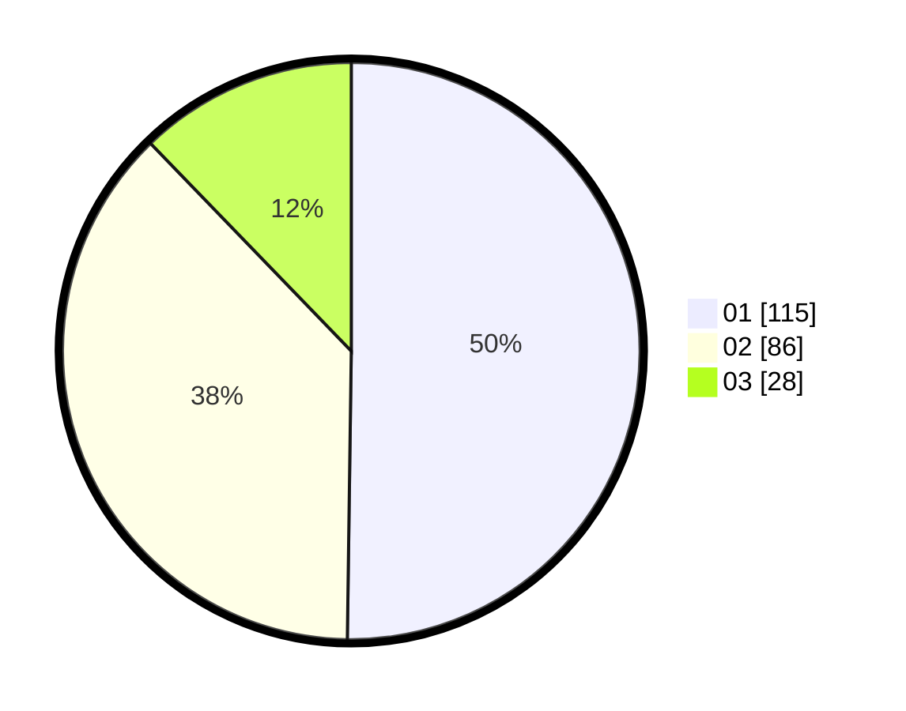

# Hasil

Hasil perolehan suara paslon dapat dilihat pada file paslon-01.txt, paslon-02.txt, dan paslon-03.txt.

Jika tidak ada, artinya data tersebut belum ada pada SIREKAP.

## Perolehan Suara

 * Paslon 01: **115**.
 * Paslon 02: **86**.
 * Paslon 03: **28**.

## Foto C Plano

https://sirekap-obj-formc.kpu.go.id/cbf9/pemilu/ppwp/31/74/09/10/03/3174091003076-20240214-213707--a595a18f-4bf5-41e1-ac19-f0cd66792126.jpg

https://sirekap-obj-formc.kpu.go.id/cbf9/pemilu/ppwp/31/74/09/10/03/3174091003076-20240214-234100--bd4e9764-192c-4908-97e2-fd9cc08bb218.jpg

https://sirekap-obj-formc.kpu.go.id/cbf9/pemilu/ppwp/31/74/09/10/03/3174091003076-20240214-233904--39dd69bb-4e4b-4c3c-968f-54a1622502f4.jpg
