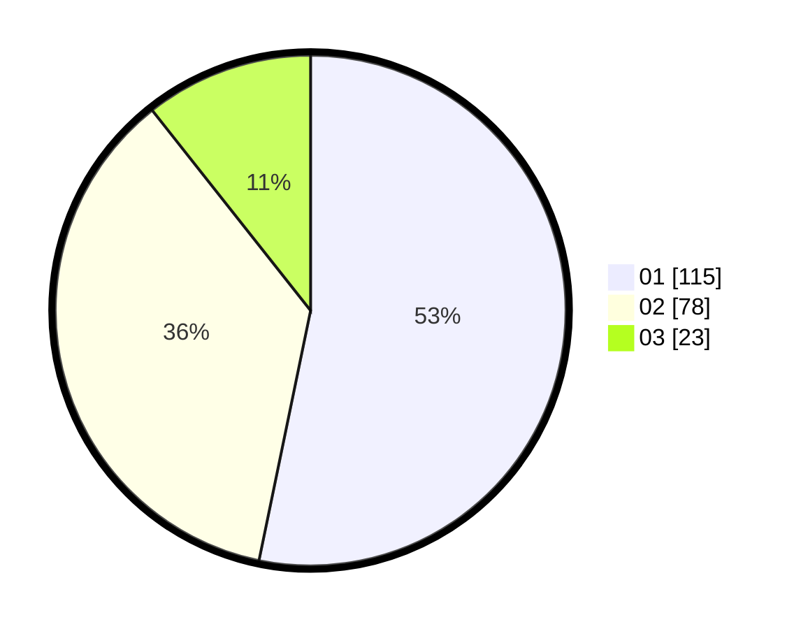

# Hasil

Hasil perolehan suara paslon dapat dilihat pada file paslon-01.txt, paslon-02.txt, dan paslon-03.txt.

Jika tidak ada, artinya data tersebut belum ada pada SIREKAP.

## Perolehan Suara

 * Paslon 01: **115**.
 * Paslon 02: **78**.
 * Paslon 03: **23**.

## Foto C Plano

https://sirekap-obj-formc.kpu.go.id/cde8/pemilu/ppwp/31/74/09/10/03/3174091003077-20240214-212512--1cfd80fc-186d-4a42-962c-9c2a3abdbaf2.jpg

https://sirekap-obj-formc.kpu.go.id/cde8/pemilu/ppwp/31/74/09/10/03/3174091003077-20240214-213453--017956b9-7fc6-4999-aacb-106adee25865.jpg
