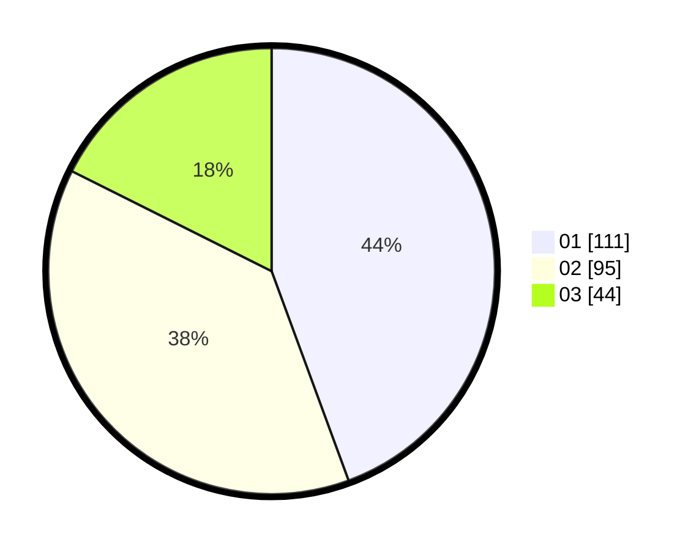

# Hasil

Hasil perolehan suara paslon dapat dilihat pada file paslon-01.txt, paslon-02.txt, dan paslon-03.txt.

Jika tidak ada, artinya data tersebut belum ada pada SIREKAP.

## Perolehan Suara

 * Paslon 01: **111**.
 * Paslon 02: **95**.
 * Paslon 03: **44**.

## Foto C Plano

https://sirekap-obj-formc.kpu.go.id/b277/pemilu/ppwp/31/74/09/10/03/3174091003087-20240214-190230--25ed3bb4-26dc-4594-b81b-473d7f57bad3.jpg

https://sirekap-obj-formc.kpu.go.id/b277/pemilu/ppwp/31/74/09/10/03/3174091003087-20240214-190247--2c5e6d32-109d-49b8-9171-4903778a6242.jpg

https://sirekap-obj-formc.kpu.go.id/b277/pemilu/ppwp/31/74/09/10/03/3174091003087-20240214-190303--8f64c147-d9b1-4c1e-bd7e-7d5f20e4d945.jpg
