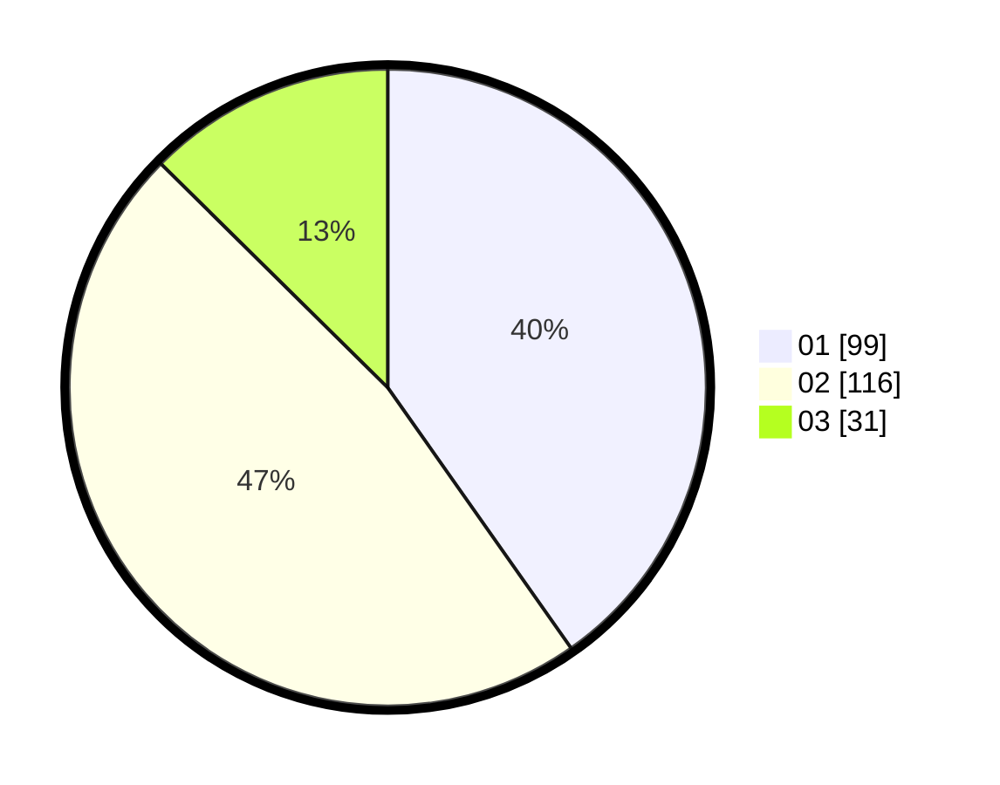

# Hasil

Hasil perolehan suara paslon dapat dilihat pada file paslon-01.txt, paslon-02.txt, dan paslon-03.txt.

Jika tidak ada, artinya data tersebut belum ada pada SIREKAP.

## Perolehan Suara

 * Paslon 01: **99**.
 * Paslon 02: **116**.
 * Paslon 03: **31**.

## Foto C Plano

https://sirekap-obj-formc.kpu.go.id/e304/pemilu/ppwp/31/74/09/10/03/3174091003092-20240216-182347--de862322-8713-4b05-b859-ec4c713dc518.jpg

https://sirekap-obj-formc.kpu.go.id/e304/pemilu/ppwp/31/74/09/10/03/3174091003092-20240214-200552--4ef1d3a6-190f-45f1-8a5a-35d263a39b30.jpg

https://sirekap-obj-formc.kpu.go.id/e304/pemilu/ppwp/31/74/09/10/03/3174091003092-20240216-182347--a8de34fe-5df3-44fe-a01e-e7c6f2cc6537.jpg

## DATA PEMILIH TETAP

Jumlah pemilih dalam DPT: **292**.
 * L: **139**.
 * P: **153**.

## DATA PENGGUNA HAK PILIH

Jumlah pengguna hak pilih dalam DPT: **234**.
 * L: **110**.
 * P: **124**.

Jumlah pengguna hak pilih dalam DPTb: **11**.
 * L: **2**.
 * P: **9**.

Jumlah pengguna hak pilih dalam DPK: **5**.
 * L: **1**.
 * P: **4**.

Jumlah pengguna hak pilih: **250**.
 * L: **113**.
 * P: **137**.

## JUMLAH SUARA SAH DAN TIDAK SAH

JUMLAH SELURUH SUARA SAH: **246**.

JUMLAH SUARA TIDAK SAH: **4**.

JUMLAH SELURUH SUARA SAH DAN SUARA TIDAK SAH: **250**.
