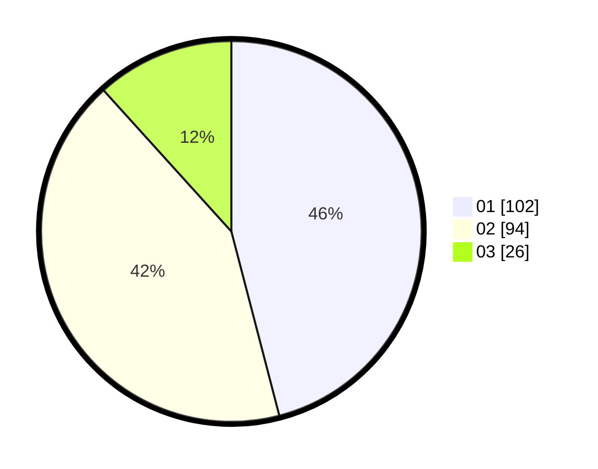

# Hasil

Hasil perolehan suara paslon dapat dilihat pada file paslon-01.txt, paslon-02.txt, dan paslon-03.txt.

Jika tidak ada, artinya data tersebut belum ada pada SIREKAP.

## Perolehan Suara

 * Paslon 01: **102**.
 * Paslon 02: **94**.
 * Paslon 03: **26**.

## Foto C Plano

https://sirekap-obj-formc.kpu.go.id/7743/pemilu/ppwp/31/74/09/10/03/3174091003093-20240214-190100--5ec88fb6-1319-4ca1-840f-318fbc0a092f.jpg

https://sirekap-obj-formc.kpu.go.id/7743/pemilu/ppwp/31/74/09/10/03/3174091003093-20240214-190116--35a2002c-6a7b-479c-9139-5324b2c9704f.jpg

https://sirekap-obj-formc.kpu.go.id/7743/pemilu/ppwp/31/74/09/10/03/3174091003093-20240214-190121--a80dde7c-5975-4758-9e8e-cb07fea093fb.jpg

## DATA PEMILIH TETAP

Jumlah pemilih dalam DPT: **288**.
 * L: **147**.
 * P: **141**.

## DATA PENGGUNA HAK PILIH

Jumlah pengguna hak pilih dalam DPT: **218**.
 * L: **102**.
 * P: **116**.

Jumlah pengguna hak pilih dalam DPTb: **2**.
 * L: **0**.
 * P: **2**.

Jumlah pengguna hak pilih dalam DPK: **8**.
 * L: **4**.
 * P: **4**.

Jumlah pengguna hak pilih: **228**.
 * L: **106**.
 * P: **722**.

## JUMLAH SUARA SAH DAN TIDAK SAH

JUMLAH SELURUH SUARA SAH: **222**.

JUMLAH SUARA TIDAK SAH: **6**.

JUMLAH SELURUH SUARA SAH DAN SUARA TIDAK SAH: **228**.
