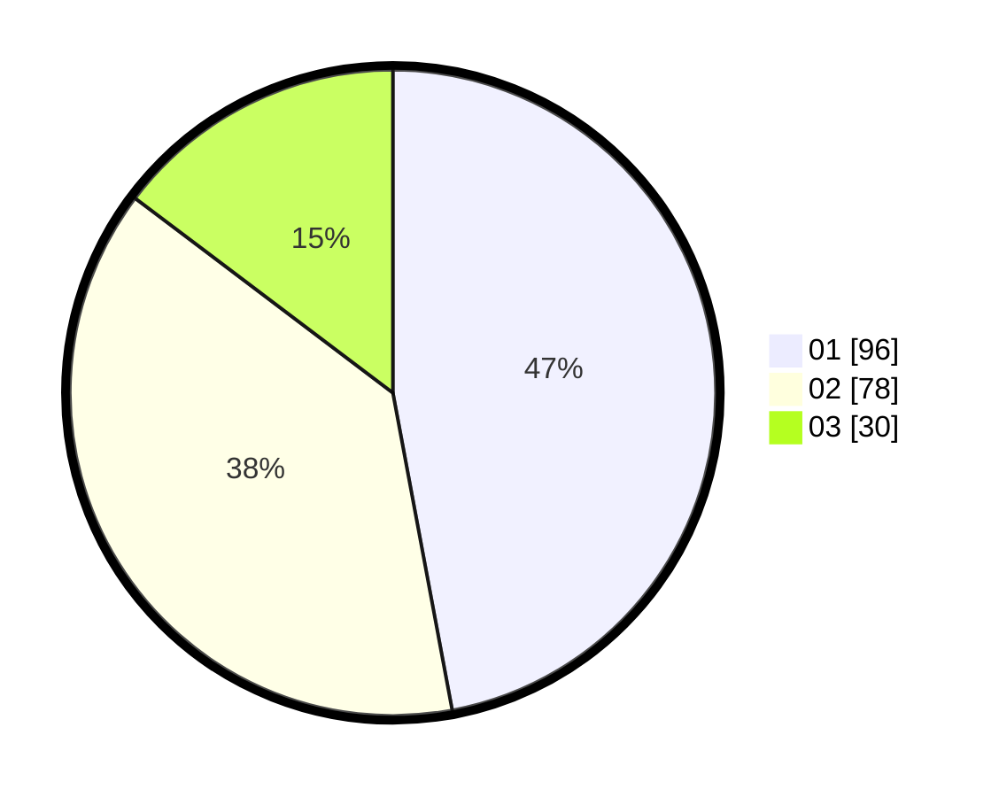

# Hasil

Hasil perolehan suara paslon dapat dilihat pada file paslon-01.txt, paslon-02.txt, dan paslon-03.txt.

Jika tidak ada, artinya data tersebut belum ada pada SIREKAP.

## Perolehan Suara

 * Paslon 01: **96**.
 * Paslon 02: **78**.
 * Paslon 03: **30**.

## Foto C Plano

https://sirekap-obj-formc.kpu.go.id/6256/pemilu/ppwp/31/74/09/10/03/3174091003103-20240215-011926--b3a678a8-b790-40ce-a38d-f976ac82ae7d.jpg

https://sirekap-obj-formc.kpu.go.id/6256/pemilu/ppwp/31/74/09/10/03/3174091003103-20240215-012121--78bdbbaf-a178-49d4-a12f-52db41ab9276.jpg

https://sirekap-obj-formc.kpu.go.id/6256/pemilu/ppwp/31/74/09/10/03/3174091003103-20240215-012336--67fcae34-bda4-436e-8153-a0f7f2718bf5.jpg

## DATA PEMILIH TETAP

Jumlah pemilih dalam DPT: **275**.
 * L: **133**.
 * P: **142**.

## DATA PENGGUNA HAK PILIH

Jumlah pengguna hak pilih dalam DPT: **205**.
 * L: **100**.
 * P: **105**.

Jumlah pengguna hak pilih dalam DPTb: **2**.
 * L: **1**.
 * P: **1**.

Jumlah pengguna hak pilih dalam DPK: **0**.
 * L: **0**.
 * P: **0**.

Jumlah pengguna hak pilih: **207**.
 * L: **101**.
 * P: **106**.

## JUMLAH SUARA SAH DAN TIDAK SAH

JUMLAH SELURUH SUARA SAH: **204**.

JUMLAH SUARA TIDAK SAH: **3**.

JUMLAH SELURUH SUARA SAH DAN SUARA TIDAK SAH: **207**.
