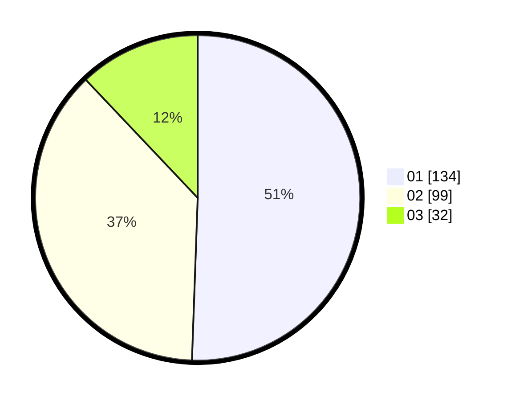

# Hasil

Hasil perolehan suara paslon dapat dilihat pada file paslon-01.txt, paslon-02.txt, dan paslon-03.txt.

Jika tidak ada, artinya data tersebut belum ada pada SIREKAP.

## Perolehan Suara

 * Paslon 01: **134**.
 * Paslon 02: **99**.
 * Paslon 03: **32**.

## Foto C Plano

https://sirekap-obj-formc.kpu.go.id/af5e/pemilu/ppwp/31/74/09/10/03/3174091003111-20240215-205316--2e000e3e-2654-4935-9171-750b510d7040.jpg

https://sirekap-obj-formc.kpu.go.id/af5e/pemilu/ppwp/31/74/09/10/03/3174091003111-20240215-205316--534e1fc0-60c2-48d4-9153-d654c65b3678.jpg

https://sirekap-obj-formc.kpu.go.id/af5e/pemilu/ppwp/31/74/09/10/03/3174091003111-20240214-194814--35c8d6c9-00c3-4fa7-a15d-2092e0cdc8dd.jpg

## DATA PEMILIH TETAP

Jumlah pemilih dalam DPT: **0**.
 * L: **0**.
 * P: **0**.

## DATA PENGGUNA HAK PILIH

Jumlah pengguna hak pilih dalam DPT: **0**.
 * L: **0**.
 * P: **0**.

Jumlah pengguna hak pilih dalam DPTb: **0**.
 * L: **0**.
 * P: **0**.

Jumlah pengguna hak pilih dalam DPK: **0**.
 * L: **0**.
 * P: **0**.

Jumlah pengguna hak pilih: **0**.
 * L: **0**.
 * P: **0**.

## JUMLAH SUARA SAH DAN TIDAK SAH

JUMLAH SELURUH SUARA SAH: **1**.

JUMLAH SUARA TIDAK SAH: **5**.

JUMLAH SELURUH SUARA SAH DAN SUARA TIDAK SAH: **270**.
