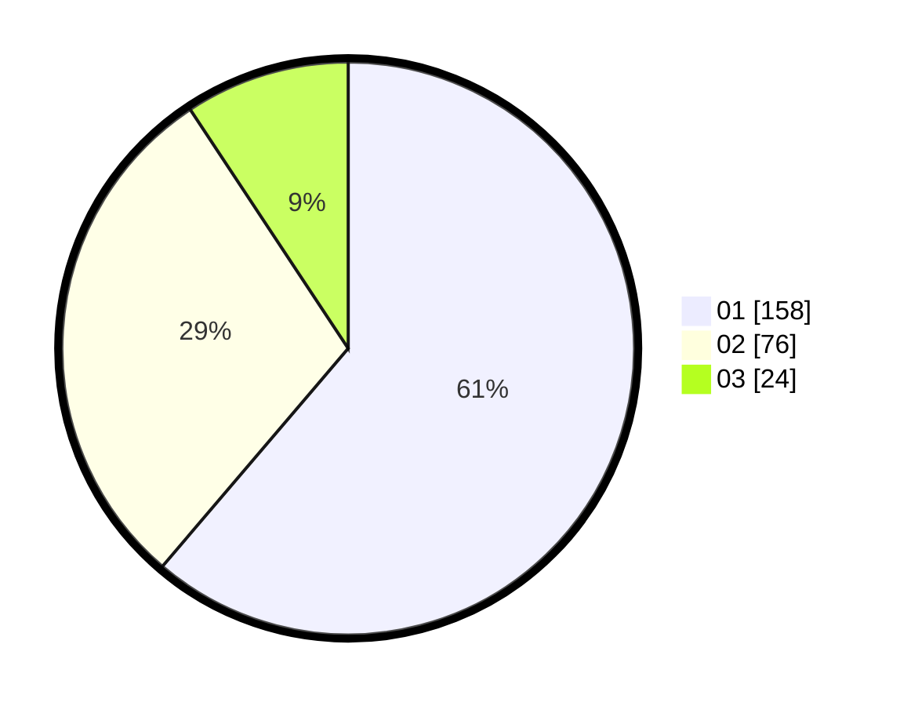

# Hasil

Hasil perolehan suara paslon dapat dilihat pada file paslon-01.txt, paslon-02.txt, dan paslon-03.txt.

Jika tidak ada, artinya data tersebut belum ada pada SIREKAP.

## Perolehan Suara

 * Paslon 01: **158**.
 * Paslon 02: **76**.
 * Paslon 03: **24**.

## Foto C Plano

https://sirekap-obj-formc.kpu.go.id/b49b/pemilu/ppwp/31/74/09/10/03/3174091003117-20240214-160108--b0059bfa-678a-4581-9431-b23bf734b4f4.jpg

https://sirekap-obj-formc.kpu.go.id/b49b/pemilu/ppwp/31/74/09/10/03/3174091003117-20240214-162223--ead88717-71a2-42a9-a2e8-a052ad337ead.jpg

https://sirekap-obj-formc.kpu.go.id/b49b/pemilu/ppwp/31/74/09/10/03/3174091003117-20240214-162227--bb3c3c1a-4e07-471e-8c2a-da8f51b9243c.jpg

## DATA PEMILIH TETAP

Jumlah pemilih dalam DPT: **298**.
 * L: **147**.
 * P: **151**.

## DATA PENGGUNA HAK PILIH

Jumlah pengguna hak pilih dalam DPT: **262**.
 * L: **124**.
 * P: **138**.

Jumlah pengguna hak pilih dalam DPTb: **1**.
 * L: **1**.
 * P: **0**.

Jumlah pengguna hak pilih dalam DPK: **1**.
 * L: **1**.
 * P: **0**.

Jumlah pengguna hak pilih: **264**.
 * L: **126**.
 * P: **138**.

## JUMLAH SUARA SAH DAN TIDAK SAH

JUMLAH SELURUH SUARA SAH: **258**.

JUMLAH SUARA TIDAK SAH: **6**.

JUMLAH SELURUH SUARA SAH DAN SUARA TIDAK SAH: **264**.
