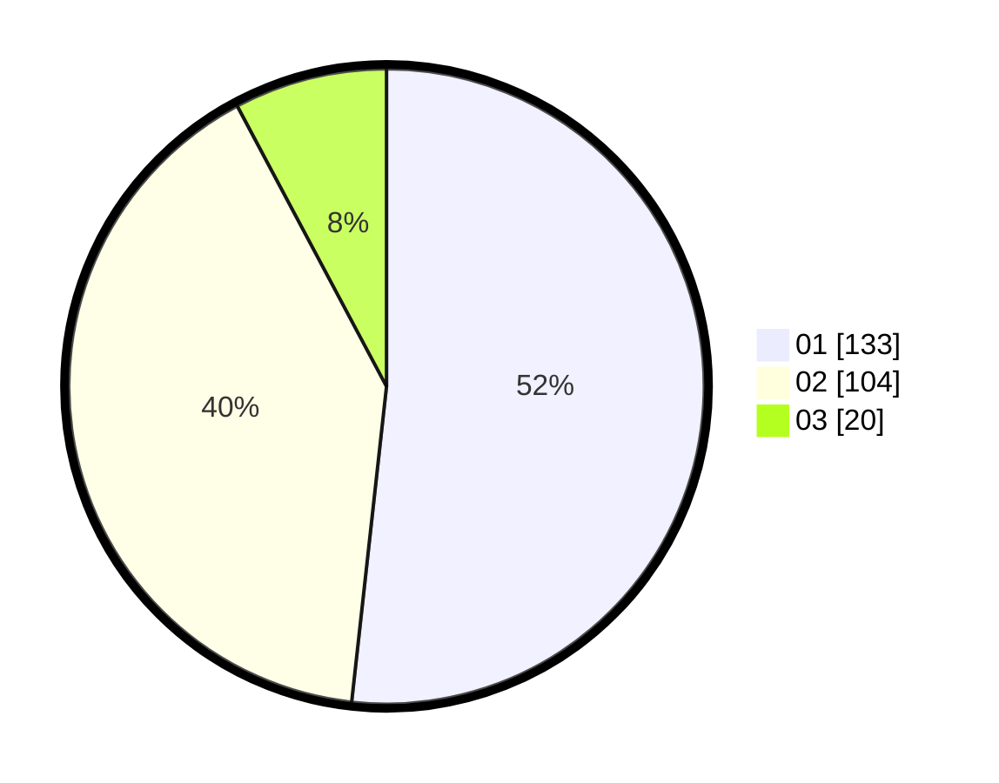

# Hasil

Hasil perolehan suara paslon dapat dilihat pada file paslon-01.txt, paslon-02.txt, dan paslon-03.txt.

Jika tidak ada, artinya data tersebut belum ada pada SIREKAP.

## Perolehan Suara

 * Paslon 01: **133**.
 * Paslon 02: **104**.
 * Paslon 03: **20**.

## Foto C Plano

https://sirekap-obj-formc.kpu.go.id/40f2/pemilu/ppwp/31/74/09/10/03/3174091003118-20240214-192150--4fc4732f-e7af-4d66-990e-6d203ec5d8ea.jpg

https://sirekap-obj-formc.kpu.go.id/40f2/pemilu/ppwp/31/74/09/10/03/3174091003118-20240214-192213--d2b453d7-40bb-46b3-9ce7-aba07937b188.jpg

https://sirekap-obj-formc.kpu.go.id/40f2/pemilu/ppwp/31/74/09/10/03/3174091003118-20240214-192229--88be9f3a-eda5-4f01-a979-38354eb51cfe.jpg

## DATA PEMILIH TETAP

Jumlah pemilih dalam DPT: **298**.
 * L: **142**.
 * P: **156**.

## DATA PENGGUNA HAK PILIH

Jumlah pengguna hak pilih dalam DPT: **255**.
 * L: **119**.
 * P: **136**.

Jumlah pengguna hak pilih dalam DPTb: **2**.
 * L: **2**.
 * P: **0**.

Jumlah pengguna hak pilih dalam DPK: **3**.
 * L: **1**.
 * P: **2**.

Jumlah pengguna hak pilih: **260**.
 * L: **122**.
 * P: **138**.

## JUMLAH SUARA SAH DAN TIDAK SAH

JUMLAH SELURUH SUARA SAH: **257**.

JUMLAH SUARA TIDAK SAH: **3**.

JUMLAH SELURUH SUARA SAH DAN SUARA TIDAK SAH: **260**.
