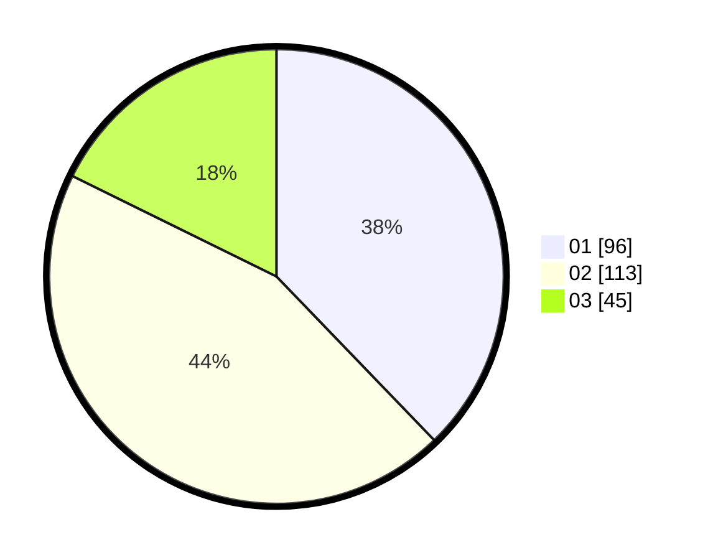

# Hasil

Hasil perolehan suara paslon dapat dilihat pada file paslon-01.txt, paslon-02.txt, dan paslon-03.txt.

Jika tidak ada, artinya data tersebut belum ada pada SIREKAP.

## Perolehan Suara

 * Paslon 01: **96**.
 * Paslon 02: **113**.
 * Paslon 03: **45**.

## Foto C Plano

https://sirekap-obj-formc.kpu.go.id/9034/pemilu/ppwp/31/74/09/10/03/3174091003123-20240215-013241--eed05b5d-f402-4a48-b161-61b53da79401.jpg

https://sirekap-obj-formc.kpu.go.id/9034/pemilu/ppwp/31/74/09/10/03/3174091003123-20240215-013919--fd505da5-ab6a-45c5-8971-9dafd46b8547.jpg

https://sirekap-obj-formc.kpu.go.id/9034/pemilu/ppwp/31/74/09/10/03/3174091003123-20240215-013434--783eb137-83ed-432f-a72b-62d55873b9a8.jpg
