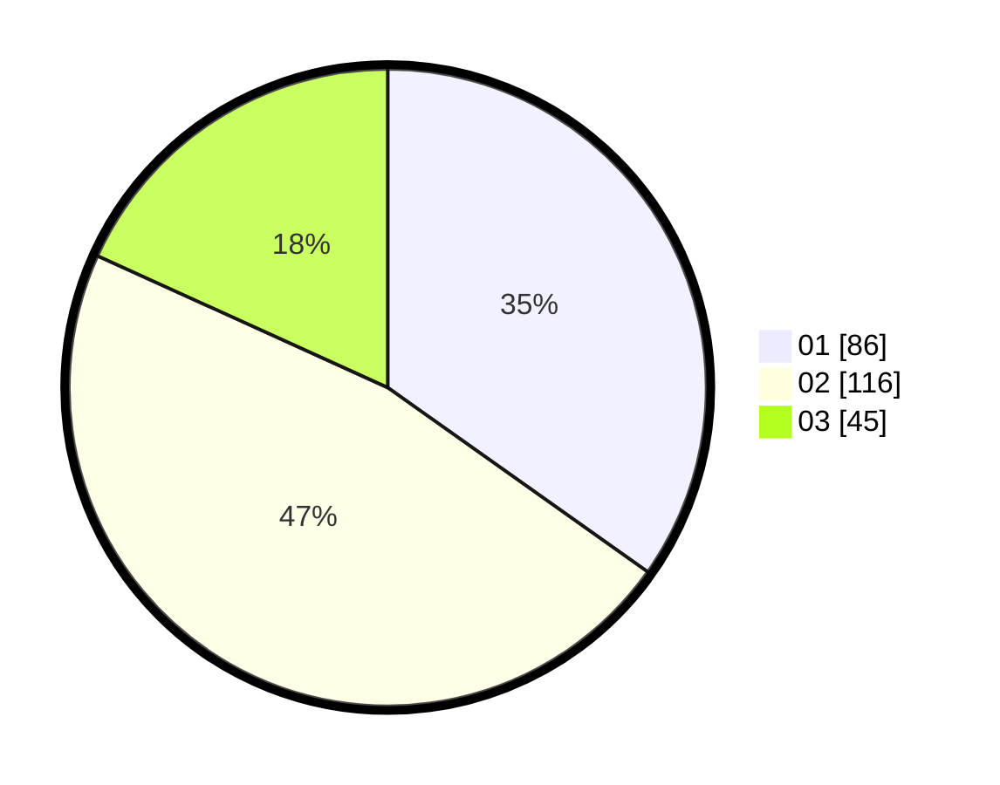

# Hasil

Hasil perolehan suara paslon dapat dilihat pada file paslon-01.txt, paslon-02.txt, dan paslon-03.txt.

Jika tidak ada, artinya data tersebut belum ada pada SIREKAP.

## Perolehan Suara

 * Paslon 01: **86**.
 * Paslon 02: **116**.
 * Paslon 03: **45**.

## Foto C Plano

https://sirekap-obj-formc.kpu.go.id/2a00/pemilu/ppwp/31/74/09/10/03/3174091003127-20240214-155632--6fa21b9c-4f7e-4004-a1d2-b1a7419aa8be.jpg

https://sirekap-obj-formc.kpu.go.id/2a00/pemilu/ppwp/31/74/09/10/03/3174091003127-20240214-155344--8fcfdd23-fe6b-4016-a1db-2546817247da.jpg

https://sirekap-obj-formc.kpu.go.id/2a00/pemilu/ppwp/31/74/09/10/03/3174091003127-20240214-155737--3f146237-ece3-4a49-94f6-666d4fac503f.jpg

## DATA PEMILIH TETAP

Jumlah pemilih dalam DPT: **297**.
 * L: **144**.
 * P: **153**.

## DATA PENGGUNA HAK PILIH

Jumlah pengguna hak pilih dalam DPT: **252**.
 * L: **119**.
 * P: **133**.

Jumlah pengguna hak pilih dalam DPTb: **1**.
 * L: **0**.
 * P: **1**.

Jumlah pengguna hak pilih dalam DPK: **0**.
 * L: **0**.
 * P: **0**.

Jumlah pengguna hak pilih: **253**.
 * L: **119**.
 * P: **134**.

## JUMLAH SUARA SAH DAN TIDAK SAH

JUMLAH SELURUH SUARA SAH: **247**.

JUMLAH SUARA TIDAK SAH: **6**.

JUMLAH SELURUH SUARA SAH DAN SUARA TIDAK SAH: **253**.
