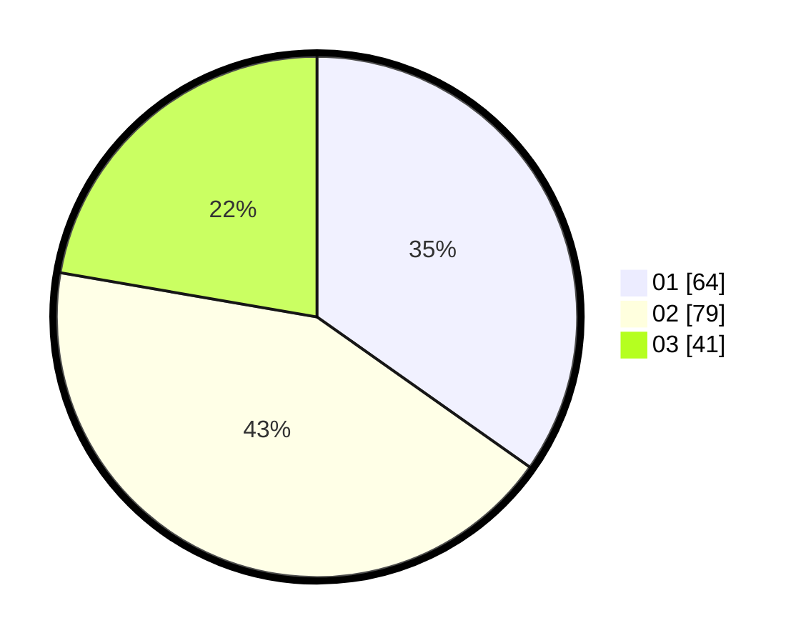

# Hasil

Hasil perolehan suara paslon dapat dilihat pada file paslon-01.txt, paslon-02.txt, dan paslon-03.txt.

Jika tidak ada, artinya data tersebut belum ada pada SIREKAP.

## Perolehan Suara

 * Paslon 01: **64**.
 * Paslon 02: **79**.
 * Paslon 03: **41**.

## Foto C Plano

https://sirekap-obj-formc.kpu.go.id/7359/pemilu/ppwp/31/74/09/10/04/3174091004004-20240214-184517--b78a69d9-7ef2-46bc-b524-453f7cbf249f.jpg

https://sirekap-obj-formc.kpu.go.id/7359/pemilu/ppwp/31/74/09/10/04/3174091004004-20240214-184632--7b9bd08a-972a-468a-9cb0-33ffd6d553ea.jpg

https://sirekap-obj-formc.kpu.go.id/7359/pemilu/ppwp/31/74/09/10/04/3174091004004-20240214-184637--24e272ce-8cf0-4a2e-8cb7-1709c612da17.jpg

## DATA PEMILIH TETAP

Jumlah pemilih dalam DPT: **231**.
 * L: **112**.
 * P: **119**.

## DATA PENGGUNA HAK PILIH

Jumlah pengguna hak pilih dalam DPT: **182**.
 * L: **82**.
 * P: **100**.

Jumlah pengguna hak pilih dalam DPTb: **3**.
 * L: **0**.
 * P: **3**.

Jumlah pengguna hak pilih dalam DPK: **4**.
 * L: **2**.
 * P: **2**.

Jumlah pengguna hak pilih: **189**.
 * L: **84**.
 * P: **105**.

## JUMLAH SUARA SAH DAN TIDAK SAH

JUMLAH SELURUH SUARA SAH: **184**.

JUMLAH SUARA TIDAK SAH: **5**.

JUMLAH SELURUH SUARA SAH DAN SUARA TIDAK SAH: **189**.
