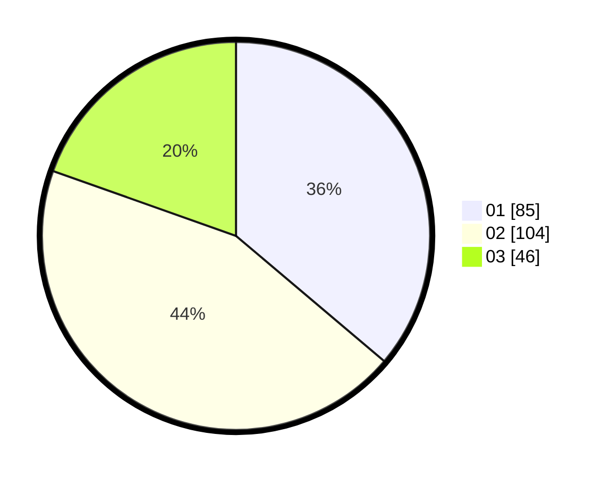

# Hasil

Hasil perolehan suara paslon dapat dilihat pada file paslon-01.txt, paslon-02.txt, dan paslon-03.txt.

Jika tidak ada, artinya data tersebut belum ada pada SIREKAP.

## Perolehan Suara

 * Paslon 01: **85**.
 * Paslon 02: **104**.
 * Paslon 03: **46**.

## Foto C Plano

https://sirekap-obj-formc.kpu.go.id/0243/pemilu/ppwp/31/74/09/10/04/3174091004011-20240215-213539--e9bfcb0a-1cb4-4f46-b589-f3ab85f357c3.jpg

https://sirekap-obj-formc.kpu.go.id/0243/pemilu/ppwp/31/74/09/10/04/3174091004011-20240215-213541--7ea8b615-2d59-463c-8513-424b302d12a6.jpg

https://sirekap-obj-formc.kpu.go.id/0243/pemilu/ppwp/31/74/09/10/04/3174091004011-20240215-213540--23745d63-ef42-425e-a13e-39559153571b.jpg

## DATA PEMILIH TETAP

Jumlah pemilih dalam DPT: **281**.
 * L: **138**.
 * P: **143**.

## DATA PENGGUNA HAK PILIH

Jumlah pengguna hak pilih dalam DPT: **222**.
 * L: **100**.
 * P: **122**.

Jumlah pengguna hak pilih dalam DPTb: **15**.
 * L: **9**.
 * P: **6**.

Jumlah pengguna hak pilih dalam DPK: **0**.
 * L: **0**.
 * P: **0**.

Jumlah pengguna hak pilih: **237**.
 * L: **109**.
 * P: **128**.

## JUMLAH SUARA SAH DAN TIDAK SAH

JUMLAH SELURUH SUARA SAH: **235**.

JUMLAH SUARA TIDAK SAH: **2**.

JUMLAH SELURUH SUARA SAH DAN SUARA TIDAK SAH: **237**.
