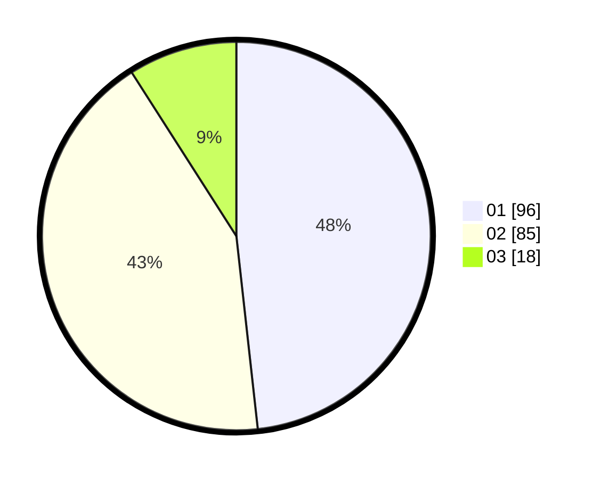

# Hasil

Hasil perolehan suara paslon dapat dilihat pada file paslon-01.txt, paslon-02.txt, dan paslon-03.txt.

Jika tidak ada, artinya data tersebut belum ada pada SIREKAP.

## Perolehan Suara

 * Paslon 01: **96**.
 * Paslon 02: **85**.
 * Paslon 03: **18**.

## Foto C Plano

https://sirekap-obj-formc.kpu.go.id/1131/pemilu/ppwp/31/74/09/10/04/3174091004014-20240214-185230--5e801979-4443-4bc3-ba25-969820584aaa.jpg

https://sirekap-obj-formc.kpu.go.id/1131/pemilu/ppwp/31/74/09/10/04/3174091004014-20240214-185240--846e7316-c76c-4798-b029-65dbb09f32de.jpg

https://sirekap-obj-formc.kpu.go.id/1131/pemilu/ppwp/31/74/09/10/04/3174091004014-20240214-185355--6aff7a80-27fb-42c4-abb8-77a5cb58b64f.jpg

## DATA PEMILIH TETAP

Jumlah pemilih dalam DPT: **254**.
 * L: **120**.
 * P: **134**.

## DATA PENGGUNA HAK PILIH

Jumlah pengguna hak pilih dalam DPT: **204**.
 * L: **96**.
 * P: **108**.

Jumlah pengguna hak pilih dalam DPTb: **0**.
 * L: **0**.
 * P: **0**.

Jumlah pengguna hak pilih dalam DPK: **0**.
 * L: **0**.
 * P: **0**.

Jumlah pengguna hak pilih: **204**.
 * L: **96**.
 * P: **108**.

## JUMLAH SUARA SAH DAN TIDAK SAH

JUMLAH SELURUH SUARA SAH: **199**.

JUMLAH SUARA TIDAK SAH: **5**.

JUMLAH SELURUH SUARA SAH DAN SUARA TIDAK SAH: **204**.
