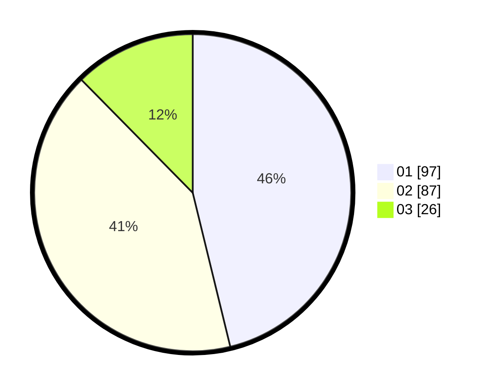

# Hasil

Hasil perolehan suara paslon dapat dilihat pada file paslon-01.txt, paslon-02.txt, dan paslon-03.txt.

Jika tidak ada, artinya data tersebut belum ada pada SIREKAP.

## Perolehan Suara

 * Paslon 01: **97**.
 * Paslon 02: **87**.
 * Paslon 03: **26**.

## Foto C Plano

https://sirekap-obj-formc.kpu.go.id/239d/pemilu/ppwp/31/74/09/10/04/3174091004015-20240214-155048--96ca3fe5-ddb3-4f4f-8674-c9b864500957.jpg

https://sirekap-obj-formc.kpu.go.id/239d/pemilu/ppwp/31/74/09/10/04/3174091004015-20240214-155057--abbee225-1118-4a1c-9b38-eb72380c706a.jpg

https://sirekap-obj-formc.kpu.go.id/239d/pemilu/ppwp/31/74/09/10/04/3174091004015-20240214-155102--fc78627f-66c7-49a5-ae0d-20872c5703ee.jpg

## DATA PEMILIH TETAP

Jumlah pemilih dalam DPT: **248**.
 * L: **117**.
 * P: **131**.

## DATA PENGGUNA HAK PILIH

Jumlah pengguna hak pilih dalam DPT: **211**.
 * L: **99**.
 * P: **112**.

Jumlah pengguna hak pilih dalam DPTb: **0**.
 * L: **0**.
 * P: **0**.

Jumlah pengguna hak pilih dalam DPK: **2**.
 * L: **1**.
 * P: **1**.

Jumlah pengguna hak pilih: **213**.
 * L: **100**.
 * P: **113**.

## JUMLAH SUARA SAH DAN TIDAK SAH

JUMLAH SELURUH SUARA SAH: **210**.

JUMLAH SUARA TIDAK SAH: **3**.

JUMLAH SELURUH SUARA SAH DAN SUARA TIDAK SAH: **213**.
