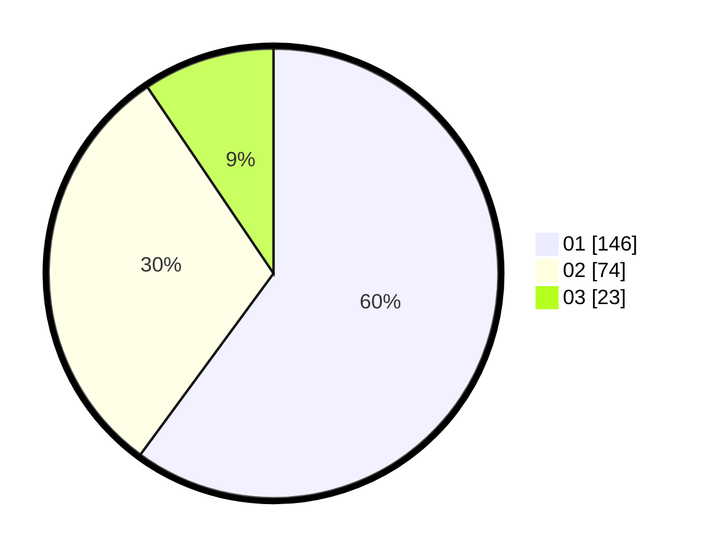

# Hasil

Hasil perolehan suara paslon dapat dilihat pada file paslon-01.txt, paslon-02.txt, dan paslon-03.txt.

Jika tidak ada, artinya data tersebut belum ada pada SIREKAP.

## Perolehan Suara

 * Paslon 01: **146**.
 * Paslon 02: **74**.
 * Paslon 03: **23**.

## Foto C Plano

https://sirekap-obj-formc.kpu.go.id/8390/pemilu/ppwp/31/74/09/10/04/3174091004025-20240214-200325--f0deb7ee-03d4-43d5-b941-d28710d76233.jpg

https://sirekap-obj-formc.kpu.go.id/8390/pemilu/ppwp/31/74/09/10/04/3174091004025-20240215-012514--fb7ec23f-9dca-4302-b5e7-07ae0467825b.jpg

https://sirekap-obj-formc.kpu.go.id/8390/pemilu/ppwp/31/74/09/10/04/3174091004025-20240214-194936--18d6380f-b999-4210-8015-878361d6a2d4.jpg

## DATA PEMILIH TETAP

Jumlah pemilih dalam DPT: **285**.
 * L: **146**.
 * P: **139**.

## DATA PENGGUNA HAK PILIH

Jumlah pengguna hak pilih dalam DPT: **245**.
 * L: **121**.
 * P: **124**.

Jumlah pengguna hak pilih dalam DPTb: **0**.
 * L: **0**.
 * P: **0**.

Jumlah pengguna hak pilih dalam DPK: **1**.
 * L: **1**.
 * P: **0**.

Jumlah pengguna hak pilih: **246**.
 * L: **122**.
 * P: **124**.

## JUMLAH SUARA SAH DAN TIDAK SAH

JUMLAH SELURUH SUARA SAH: **243**.

JUMLAH SUARA TIDAK SAH: **3**.

JUMLAH SELURUH SUARA SAH DAN SUARA TIDAK SAH: **246**.
