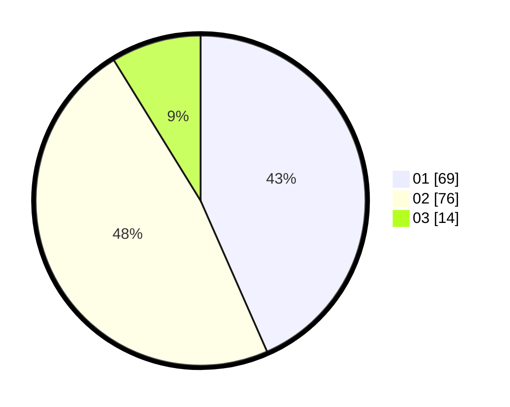

# Hasil

Hasil perolehan suara paslon dapat dilihat pada file paslon-01.txt, paslon-02.txt, dan paslon-03.txt.

Jika tidak ada, artinya data tersebut belum ada pada SIREKAP.

## Perolehan Suara

 * Paslon 01: **69**.
 * Paslon 02: **76**.
 * Paslon 03: **14**.

## Foto C Plano

https://sirekap-obj-formc.kpu.go.id/dbf6/pemilu/ppwp/31/74/09/10/04/3174091004027-20240214-212009--36546f38-274e-41f5-b053-73901046f152.jpg

https://sirekap-obj-formc.kpu.go.id/dbf6/pemilu/ppwp/31/74/09/10/04/3174091004027-20240214-212235--f4bfb946-30e4-4d47-b2f3-7322810243e9.jpg

https://sirekap-obj-formc.kpu.go.id/dbf6/pemilu/ppwp/31/74/09/10/04/3174091004027-20240214-212412--d8554421-56e3-4c2c-bd42-cc406210c594.jpg

## DATA PEMILIH TETAP

Jumlah pemilih dalam DPT: **222**.
 * L: **107**.
 * P: **115**.

## DATA PENGGUNA HAK PILIH

Jumlah pengguna hak pilih dalam DPT: **159**.
 * L: **74**.
 * P: **85**.

Jumlah pengguna hak pilih dalam DPTb: **0**.
 * L: **0**.
 * P: **0**.

Jumlah pengguna hak pilih dalam DPK: **0**.
 * L: **0**.
 * P: **0**.

Jumlah pengguna hak pilih: **159**.
 * L: **74**.
 * P: **85**.

## JUMLAH SUARA SAH DAN TIDAK SAH

JUMLAH SELURUH SUARA SAH: **159**.

JUMLAH SUARA TIDAK SAH: **0**.

JUMLAH SELURUH SUARA SAH DAN SUARA TIDAK SAH: **159**.
