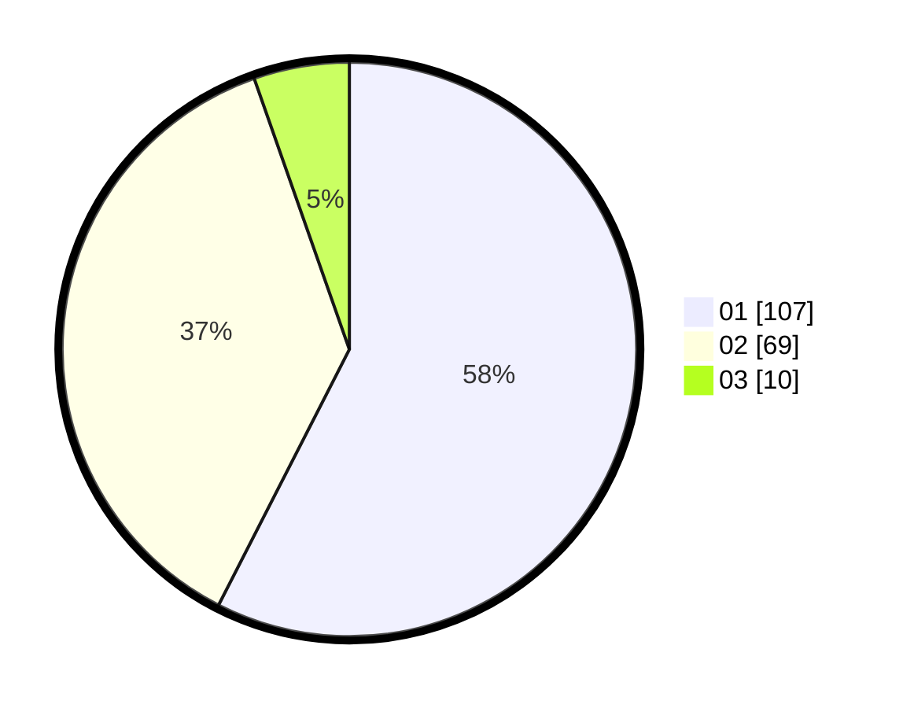

# Hasil

Hasil perolehan suara paslon dapat dilihat pada file paslon-01.txt, paslon-02.txt, dan paslon-03.txt.

Jika tidak ada, artinya data tersebut belum ada pada SIREKAP.

## Perolehan Suara

 * Paslon 01: **107**.
 * Paslon 02: **69**.
 * Paslon 03: **10**.

## Foto C Plano

https://sirekap-obj-formc.kpu.go.id/9960/pemilu/ppwp/31/74/09/10/04/3174091004031-20240217-120815--a9ddd6b5-435b-4830-8722-36ddb95b2a32.jpg

https://sirekap-obj-formc.kpu.go.id/9960/pemilu/ppwp/31/74/09/10/04/3174091004031-20240217-120820--88a54a5e-4318-455a-817f-abb68fa00b5e.jpg

https://sirekap-obj-formc.kpu.go.id/9960/pemilu/ppwp/31/74/09/10/04/3174091004031-20240217-120825--7c566f3f-66d0-4ee4-8bfb-3c4b1d2e329e.jpg

## DATA PEMILIH TETAP

Jumlah pemilih dalam DPT: **230**.
 * L: **104**.
 * P: **126**.

## DATA PENGGUNA HAK PILIH

Jumlah pengguna hak pilih dalam DPT: **190**.
 * L: **89**.
 * P: **101**.

Jumlah pengguna hak pilih dalam DPTb: **0**.
 * L: **0**.
 * P: **0**.

Jumlah pengguna hak pilih dalam DPK: **1**.
 * L: **1**.
 * P: **0**.

Jumlah pengguna hak pilih: **191**.
 * L: **90**.
 * P: **101**.

## JUMLAH SUARA SAH DAN TIDAK SAH

JUMLAH SELURUH SUARA SAH: **186**.

JUMLAH SUARA TIDAK SAH: **5**.

JUMLAH SELURUH SUARA SAH DAN SUARA TIDAK SAH: **191**.
