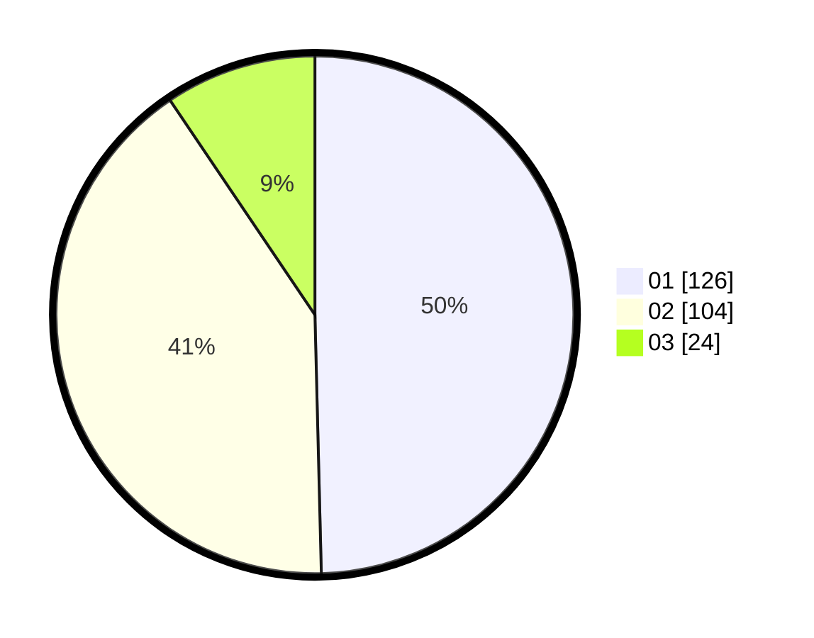

# Hasil

Hasil perolehan suara paslon dapat dilihat pada file paslon-01.txt, paslon-02.txt, dan paslon-03.txt.

Jika tidak ada, artinya data tersebut belum ada pada SIREKAP.

## Perolehan Suara

 * Paslon 01: **126**.
 * Paslon 02: **104**.
 * Paslon 03: **24**.

## Foto C Plano

https://sirekap-obj-formc.kpu.go.id/5527/pemilu/ppwp/31/74/09/10/04/3174091004034-20240214-192650--1e9fbc11-63d6-4162-8712-ccf60373df72.jpg

https://sirekap-obj-formc.kpu.go.id/5527/pemilu/ppwp/31/74/09/10/04/3174091004034-20240214-192421--2b2ae619-d562-4a7f-b55f-0e18e2e8b181.jpg

https://sirekap-obj-formc.kpu.go.id/5527/pemilu/ppwp/31/74/09/10/04/3174091004034-20240214-192517--a534884b-237f-47b3-9cac-13ba2fe504b3.jpg

## DATA PEMILIH TETAP

Jumlah pemilih dalam DPT: **291**.
 * L: **145**.
 * P: **146**.

## DATA PENGGUNA HAK PILIH

Jumlah pengguna hak pilih dalam DPT: **291**.
 * L: **145**.
 * P: **146**.

Jumlah pengguna hak pilih dalam DPTb: **17**.
 * L: **11**.
 * P: **6**.

Jumlah pengguna hak pilih dalam DPK: **2**.
 * L: **1**.
 * P: **1**.

Jumlah pengguna hak pilih: **310**.
 * L: **157**.
 * P: **153**.

## JUMLAH SUARA SAH DAN TIDAK SAH

JUMLAH SELURUH SUARA SAH: **254**.

JUMLAH SUARA TIDAK SAH: **4**.

JUMLAH SELURUH SUARA SAH DAN SUARA TIDAK SAH: **258**.
