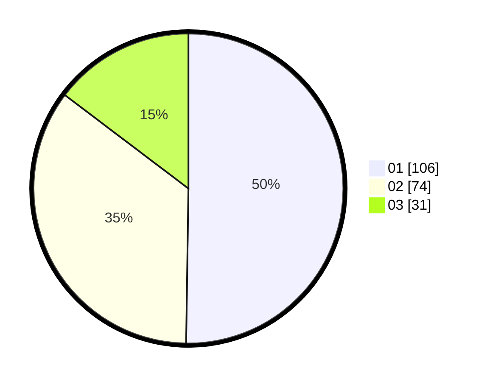

# Hasil

Hasil perolehan suara paslon dapat dilihat pada file paslon-01.txt, paslon-02.txt, dan paslon-03.txt.

Jika tidak ada, artinya data tersebut belum ada pada SIREKAP.

## Perolehan Suara

 * Paslon 01: **106**.
 * Paslon 02: **74**.
 * Paslon 03: **31**.

## Foto C Plano

https://sirekap-obj-formc.kpu.go.id/8edd/pemilu/ppwp/31/74/09/10/04/3174091004037-20240215-021018--2e0fb96e-612e-42ec-9f2d-3f73505380a3.jpg

https://sirekap-obj-formc.kpu.go.id/8edd/pemilu/ppwp/31/74/09/10/04/3174091004037-20240215-021229--50660814-8cad-4c76-836c-d6c0db3e007a.jpg

https://sirekap-obj-formc.kpu.go.id/8edd/pemilu/ppwp/31/74/09/10/04/3174091004037-20240215-021121--c0ea8b8d-3010-448c-986b-0be17237ee20.jpg

## DATA PEMILIH TETAP

Jumlah pemilih dalam DPT: **259**.
 * L: **127**.
 * P: **132**.

## DATA PENGGUNA HAK PILIH

Jumlah pengguna hak pilih dalam DPT: **213**.
 * L: **95**.
 * P: **118**.

Jumlah pengguna hak pilih dalam DPTb: **2**.
 * L: **0**.
 * P: **2**.

Jumlah pengguna hak pilih dalam DPK: **1**.
 * L: **0**.
 * P: **1**.

Jumlah pengguna hak pilih: **216**.
 * L: **95**.
 * P: **121**.

## JUMLAH SUARA SAH DAN TIDAK SAH

JUMLAH SELURUH SUARA SAH: **211**.

JUMLAH SUARA TIDAK SAH: **5**.

JUMLAH SELURUH SUARA SAH DAN SUARA TIDAK SAH: **216**.
