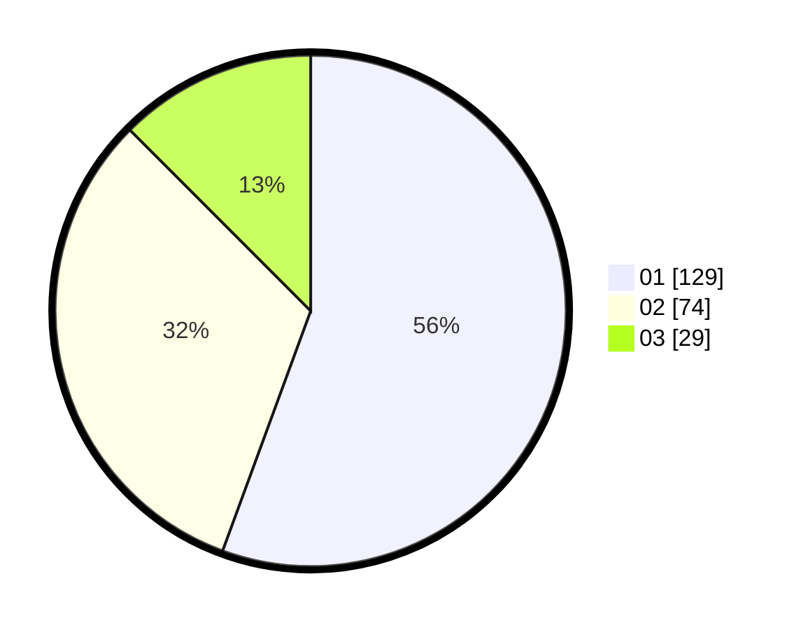

# Hasil

Hasil perolehan suara paslon dapat dilihat pada file paslon-01.txt, paslon-02.txt, dan paslon-03.txt.

Jika tidak ada, artinya data tersebut belum ada pada SIREKAP.

## Perolehan Suara

 * Paslon 01: **129**.
 * Paslon 02: **74**.
 * Paslon 03: **29**.

## Foto C Plano

https://sirekap-obj-formc.kpu.go.id/52d3/pemilu/ppwp/31/74/09/10/04/3174091004042-20240214-185511--3c79264a-cdc4-410e-8db0-af453b81a27e.jpg

https://sirekap-obj-formc.kpu.go.id/52d3/pemilu/ppwp/31/74/09/10/04/3174091004042-20240214-185116--3baf4ba0-4c2a-43ed-a2df-9c7d29f117a1.jpg

https://sirekap-obj-formc.kpu.go.id/52d3/pemilu/ppwp/31/74/09/10/04/3174091004042-20240214-185327--4e96c2ef-247c-48cc-b0ba-0068ceb6caba.jpg

## DATA PEMILIH TETAP

Jumlah pemilih dalam DPT: **234**.
 * L: **117**.
 * P: **117**.

## DATA PENGGUNA HAK PILIH

Jumlah pengguna hak pilih dalam DPT: **231**.
 * L: **115**.
 * P: **116**.

Jumlah pengguna hak pilih dalam DPTb: **1**.
 * L: **1**.
 * P: **0**.

Jumlah pengguna hak pilih dalam DPK: **2**.
 * L: **1**.
 * P: **1**.

Jumlah pengguna hak pilih: **234**.
 * L: **117**.
 * P: **117**.

## JUMLAH SUARA SAH DAN TIDAK SAH

JUMLAH SELURUH SUARA SAH: **232**.

JUMLAH SUARA TIDAK SAH: **2**.

JUMLAH SELURUH SUARA SAH DAN SUARA TIDAK SAH: **234**.
