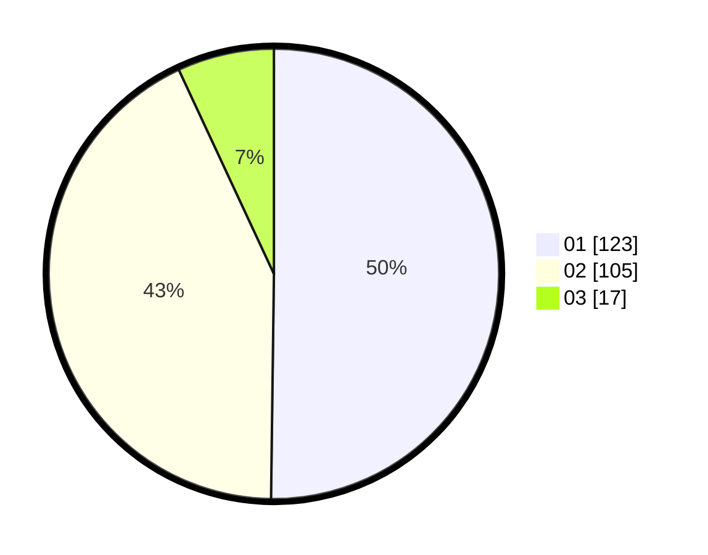

# Hasil

Hasil perolehan suara paslon dapat dilihat pada file paslon-01.txt, paslon-02.txt, dan paslon-03.txt.

Jika tidak ada, artinya data tersebut belum ada pada SIREKAP.

## Perolehan Suara

 * Paslon 01: **123**.
 * Paslon 02: **105**.
 * Paslon 03: **17**.

## Foto C Plano

https://sirekap-obj-formc.kpu.go.id/0357/pemilu/ppwp/31/74/09/10/04/3174091004045-20240215-211825--f1640782-3322-4e97-8ce3-33ff7af62c38.jpg

https://sirekap-obj-formc.kpu.go.id/0357/pemilu/ppwp/31/74/09/10/04/3174091004045-20240215-214632--7c9e9959-3320-4e46-b92a-0992958556cc.jpg

https://sirekap-obj-formc.kpu.go.id/0357/pemilu/ppwp/31/74/09/10/04/3174091004045-20240215-215816--3d540538-db59-421a-80f3-69d590609e9b.jpg

## DATA PEMILIH TETAP

Jumlah pemilih dalam DPT: **245**.
 * L: **124**.
 * P: **121**.

## DATA PENGGUNA HAK PILIH

Jumlah pengguna hak pilih dalam DPT: **244**.
 * L: **123**.
 * P: **121**.

Jumlah pengguna hak pilih dalam DPTb: **1**.
 * L: **1**.
 * P: **0**.

Jumlah pengguna hak pilih dalam DPK: **0**.
 * L: **0**.
 * P: **0**.

Jumlah pengguna hak pilih: **245**.
 * L: **124**.
 * P: **121**.

## JUMLAH SUARA SAH DAN TIDAK SAH

JUMLAH SELURUH SUARA SAH: **245**.

JUMLAH SUARA TIDAK SAH: **3**.

JUMLAH SELURUH SUARA SAH DAN SUARA TIDAK SAH: **248**.
