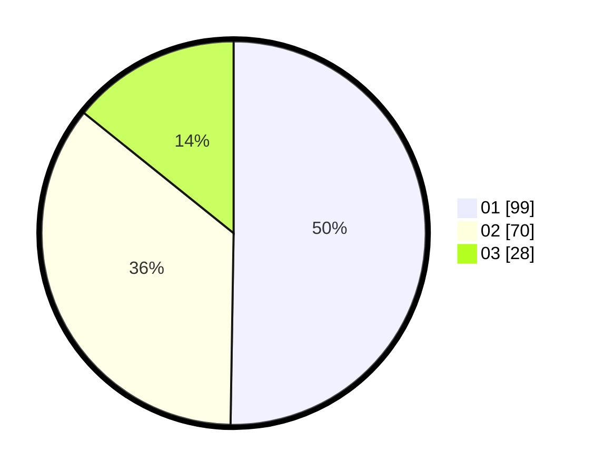

# Hasil

Hasil perolehan suara paslon dapat dilihat pada file paslon-01.txt, paslon-02.txt, dan paslon-03.txt.

Jika tidak ada, artinya data tersebut belum ada pada SIREKAP.

## Perolehan Suara

 * Paslon 01: **99**.
 * Paslon 02: **70**.
 * Paslon 03: **28**.

## Foto C Plano

https://sirekap-obj-formc.kpu.go.id/65e3/pemilu/ppwp/31/74/09/10/04/3174091004052-20240214-200545--b6493556-eee5-4003-8ceb-9506c545e7ac.jpg

https://sirekap-obj-formc.kpu.go.id/65e3/pemilu/ppwp/31/74/09/10/04/3174091004052-20240214-200819--92bbe336-0e38-4b81-bc13-5e18faa5ac32.jpg

https://sirekap-obj-formc.kpu.go.id/65e3/pemilu/ppwp/31/74/09/10/04/3174091004052-20240214-201010--191ed55f-1af3-491b-8b83-cee9299e00c9.jpg

## DATA PEMILIH TETAP

Jumlah pemilih dalam DPT: **192**.
 * L: **96**.
 * P: **96**.

## DATA PENGGUNA HAK PILIH

Jumlah pengguna hak pilih dalam DPT: **223**.
 * L: **114**.
 * P: **109**.

Jumlah pengguna hak pilih dalam DPTb: **7**.
 * L: **5**.
 * P: **2**.

Jumlah pengguna hak pilih dalam DPK: **1**.
 * L: **0**.
 * P: **1**.

Jumlah pengguna hak pilih: **231**.
 * L: **119**.
 * P: **112**.

## JUMLAH SUARA SAH DAN TIDAK SAH

JUMLAH SELURUH SUARA SAH: **197**.

JUMLAH SUARA TIDAK SAH: **2**.

JUMLAH SELURUH SUARA SAH DAN SUARA TIDAK SAH: **199**.
