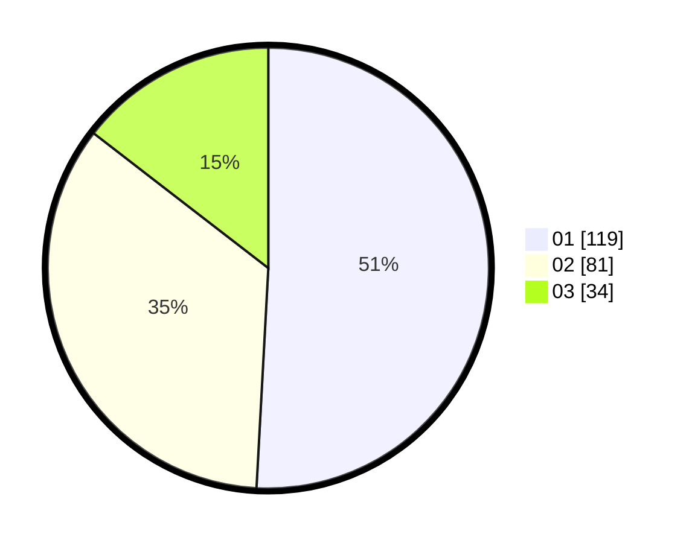

# Hasil

Hasil perolehan suara paslon dapat dilihat pada file paslon-01.txt, paslon-02.txt, dan paslon-03.txt.

Jika tidak ada, artinya data tersebut belum ada pada SIREKAP.

## Perolehan Suara

 * Paslon 01: **119**.
 * Paslon 02: **81**.
 * Paslon 03: **34**.

## Foto C Plano

https://sirekap-obj-formc.kpu.go.id/a38a/pemilu/ppwp/31/74/09/10/04/3174091004054-20240217-202748--7b252b28-5535-4bb2-a6fd-a2a6d16b8d84.jpg

https://sirekap-obj-formc.kpu.go.id/a38a/pemilu/ppwp/31/74/09/10/04/3174091004054-20240217-195149--6a9146d4-0317-4a4f-823c-e85614e13f1a.jpg

https://sirekap-obj-formc.kpu.go.id/a38a/pemilu/ppwp/31/74/09/10/04/3174091004054-20240217-195343--3e800a4f-9cee-4009-a459-7d3e0a68753f.jpg

## DATA PEMILIH TETAP

Jumlah pemilih dalam DPT: **286**.
 * L: **144**.
 * P: **142**.

## DATA PENGGUNA HAK PILIH

Jumlah pengguna hak pilih dalam DPT: **221**.
 * L: **107**.
 * P: **114**.

Jumlah pengguna hak pilih dalam DPTb: **14**.
 * L: **13**.
 * P: **1**.

Jumlah pengguna hak pilih dalam DPK: **2**.
 * L: **1**.
 * P: **1**.

Jumlah pengguna hak pilih: **237**.
 * L: **121**.
 * P: **116**.

## JUMLAH SUARA SAH DAN TIDAK SAH

JUMLAH SELURUH SUARA SAH: **234**.

JUMLAH SUARA TIDAK SAH: **3**.

JUMLAH SELURUH SUARA SAH DAN SUARA TIDAK SAH: **237**.
