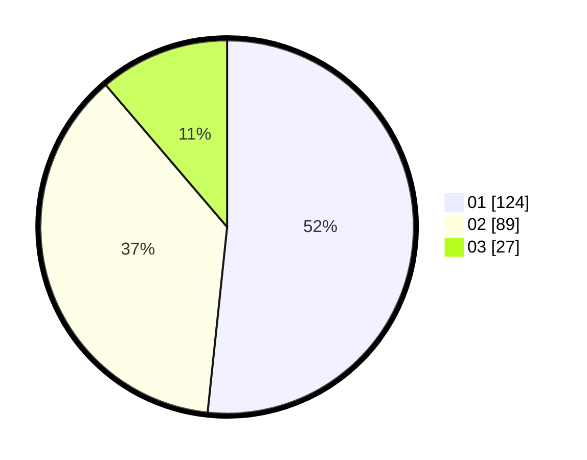

# Hasil

Hasil perolehan suara paslon dapat dilihat pada file paslon-01.txt, paslon-02.txt, dan paslon-03.txt.

Jika tidak ada, artinya data tersebut belum ada pada SIREKAP.

## Perolehan Suara

 * Paslon 01: **124**.
 * Paslon 02: **89**.
 * Paslon 03: **27**.

## Foto C Plano

https://sirekap-obj-formc.kpu.go.id/1a6a/pemilu/ppwp/31/74/09/10/04/3174091004061-20240216-163058--884bd887-ea24-4d4b-9d3a-73df55640d1b.jpg

https://sirekap-obj-formc.kpu.go.id/1a6a/pemilu/ppwp/31/74/09/10/04/3174091004061-20240216-163059--27fbd51d-47e7-4ac2-ab2e-ddbfc7abfcc2.jpg

https://sirekap-obj-formc.kpu.go.id/1a6a/pemilu/ppwp/31/74/09/10/04/3174091004061-20240216-163058--72a6676a-403e-45f6-b616-e378da67a379.jpg

## DATA PEMILIH TETAP

Jumlah pemilih dalam DPT: **294**.
 * L: **148**.
 * P: **146**.

## DATA PENGGUNA HAK PILIH

Jumlah pengguna hak pilih dalam DPT: **247**.
 * L: **118**.
 * P: **129**.

Jumlah pengguna hak pilih dalam DPTb: **2**.
 * L: **1**.
 * P: **1**.

Jumlah pengguna hak pilih dalam DPK: **0**.
 * L: **0**.
 * P: **0**.

Jumlah pengguna hak pilih: **249**.
 * L: **119**.
 * P: **130**.

## JUMLAH SUARA SAH DAN TIDAK SAH

JUMLAH SELURUH SUARA SAH: **240**.

JUMLAH SUARA TIDAK SAH: **9**.

JUMLAH SELURUH SUARA SAH DAN SUARA TIDAK SAH: **249**.
